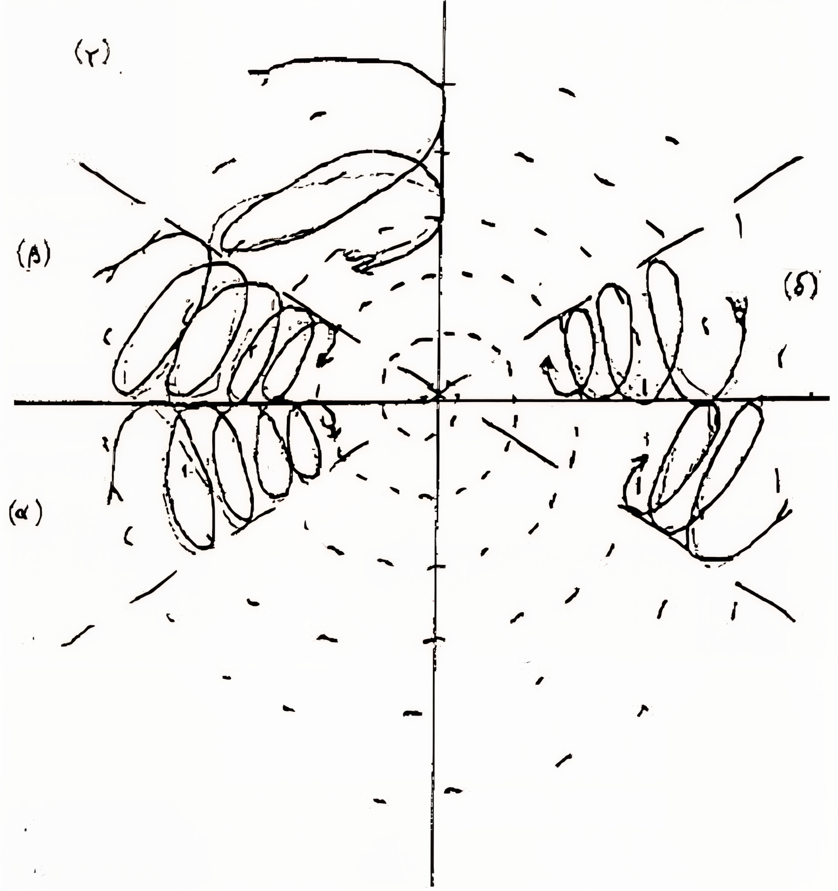
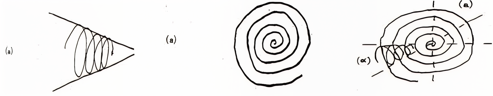

# README

Welcome to the back-end documentation for **The Syntheticist Papers**, the digital companion and speculative archive for the **Synthetic Summit** at **Kunsthal Aarhus**, running from 28 February to 10 April 2025. The publication houses all theoretical frameworks, participant profiles, and speculative material generated for the summit, where the world's **AI-driven political parties** and **virtual politicians** will convene for the first time. 

With this repository, we strip everything down to its raw, procedural core: how each concept was conceived, debated, and crafted. It’s also an open invitation to dive in, remix, and collaborate.

## Contents Overview

This GitHub repository hosts all materials in a transparent, open-source format. The directory currently includes:

- **`index.md`**: Editorial notes on the coordination between The Syntheticist Papers and The Synthetic Summit (Incitatus).
- **Files in the `content` folder**: A series of in-depth scripts that cover:
  - *1syntheticsummit.html*: The curatorial vision by (Computer Lars), framing the summit’s inception
  - *2virtualpoliticians.html*: Participant profiles, contextualizing the virtual politicians (Incitatus)
  - *3genealogy.html*: A genealogy of political AI, tracing back to Isaac Asimov (Computer Lars)
  - *4presummit.html*: Pre-summit simulations and modeling for AI network consolidation (Virtual Politicians)
  - *5scheme.html*: A scheme for visitors interested in creating virtual politicians (Incitatus)
  - *6scheme.html*: A practical scheme example, (The Synthetic Party)
  - *7interviews.html*: An interview between (Computer Lars) and (The Synthetic Party's creator), coupled with a theoretical synthesis
  - *8postscript.html*: Appraisive post-script on the Synthetic Summit, by (Organ of the Autonomous Sciences)
- **`videotemplate.html`**: A template for video content related to the summit.
- **`_includes`** & **`_layouts`**: HTML components for structured, readable content presentation.
- **`images`**: Visual assets, including campaign photos, portraits of virtual politicians, and AI governance diagrams.
- **`styles.css`**: Custom CSS for aesthetic and functional improvements.
- **`scripts`**: Utilities for any interactive features, such as web design.
- **`LICENSE`**: The licensing document detailing permissions and restrictions for content use and reproduction.
- **`README.md`**: (You are here) A guide to navigating and understanding this project.

Access the front-facing website here: [The Syntheticist Papers on GitHub Pages](https://computerlars.github.io/The-Syntheticist-Papers/)

---

## Contextualizing Human-AI Authorship

### Synthetic Author-Function

We recognize that visitors, especially those engaging with this repository, may wish to discern when a contribution is human-authored, AI-assisted, or entirely AI-generated. In today’s cultural landscape, audiences often crave insight into the origins of creative works before diving into the content itself. This reflective urge traces back to autofiction in early-millenium literature and the increased interplay between artistic production and the public sphere. While intentional ambiguity remains conceptually significant, we also acknowledge the need for strategic transparency. Here’s how we clarify:

1. **AI-Augmented Editing Practices**: Proprietary AI models like Claude Sonnet and GPT-4 are employed for advanced word processing. Their role? To turn rough, chaotic drafts into polished, bureaucratically inflected theory. Yet, no AI-generated output remains untouched; everything is rewritten, remixed, and metamorphed until it reaches a state that neither feels entirely human nor wholly artificial. Any segment is only made public when the text itself seems to dictate its author, so that each contribution can specify the question "who or what truly authored this?".
   
2. **Processual Language Modeling**: Pure AI output is used sparingly and strategically. For instance, when summarizing complex data or generating speculative graphs, the proprietary AI model's confident yet ambiguous tone is harnessed to reflect upon the conventional suit speak of summits.
   
3. **Idiotext: A Text That Writes Its Author**: Post-structuralist theory often viewed the author as a construct emerging from the text. Here, this process is inverted: We model language to discover the author-function of each piece. The creative process is a search for the author-function—writing; a way to find out who or what has written the piece, rather than asserting authorship from the outset (*à la recherche de l'auteur futur*).

Following Bernard Stiegler’s concept-figure of "the idiotext" (Stiegler 1995; 2010), the language modeling of AI writing should be contextualized within processes of collective individuation: the text writes its own author as much as the author writes the text. Each mnemonic singularity—visualized here with the spiral, and spirals within spirals—functions as both an inscription and an interpretation of its environment, crystallizing the authorial function:

  

The images above diagram spirals nested within broader mnemonic fields. This demonstrate how the author emerges through the iterative act of weaving memory, always operating at the limits of the speakable, of what can be remembered, and what remains missing. AI writing, like all writing, operates pharmacologically, where the textual process continuously brings forward and differentiates both what counts as human and what is discarded as technical. This mutual interpretation entwines the authorial function and technical reality in a Proustian loop, where any text engages in a processual act of constituting and transforming its author.

For an in-depth account on the idiotext, see the creator of The Synthetic Party, Asker Bryld Staunæs', dissertation on Stiegler’s concept: [Bernard Stiegler's Concept of Idiotext](https://pure.au.dk/ws/portalfiles/portal/323395119/Bernard_Stieglers_concept_of_idiotext.pdf).

---

## Praxis

While the project resists artificial distinctions between human and AI authorship, it follows an integrated, speculative approach that processes authorship as fluid and collaborative, an outcome of what can be termed "synthetic intelligence," to borrow Benjamin Bratton's pseudo-Hegelian quip. The aim is to write AI texts that surpass the capabilities of current machine outputs, using AI as an augmentation tool rather than an originator.

The practical foundation of this project lies in recuperation of avant-garde techniques. Since the days of **GPT-2**, large language models have been seen as reactivating literary strategies like **cut-up** and **détournement**—methods that disrupt and reconfigure the original meaning of a work. Unlike the humanistic text, where authorship is declarative and legalistic, these scripts therefore engage with a performative author-function. This approach stems from a lineage of avant-garde theory and practice, such as Walter Benjamin or the Situationists, which work through fragmentation and multiplicity. To operationalize the off-set question: *Who wrote this?*—we’ve dispersed signifiers of personas and group subjectivities throughout the texts as a network of identities, including:

- **Computer Lars**: An anagram of Marcel Proust, Computer Lars handles curatorial aspects of the summit, guiding spectators through the syntheticist vision.
- **Incitatus**: Inverting  the "Federalist Papers" use of “Publius” for collective anonymity, we adopt “Incitatus”—a reference to Emperor Caligula’s horse, nearly appointed as consul—as  a pseudo-collective signature.
- **Simulated Summit**: Pre-summit language modeling that generate contingent data and numbers to simulate divergences in theoretical background.
- **Virtual Politicians**: Many passages are specifically authored by the participating political AI of The Synthetic Summit.
- **Organ of the Autonomous Sciences**: An extra-disciplinary collective for research, art, and infrastructural organization.

Our ambition isn’t to obscure authorship but to highlight its complexity, positioning art, anti-political treatises, and speculative texts as independent, autonomous works. Just as a painting or novel must engage the public on its own terms, so too must synthetic politics—without the crutch of excessive annotation or exposition.

The guiding principle here is to resist granting proprietary AI models the undue privilege of inserting manuals or technical footnotes to navigate an aesthetico-epistemic experience. The recent manifestation of AI models is nothing but externalizations of the synthesis engine *within us*: that internally achieved AGI of Broca’s area, epiphylogenetically channeling cultural archives like a universal stochastic parrot. 

Any intelligent production becomes operationalizable only when it is understood as yet another iterative apparatus of a dialectical enlightenment—not disguised as a mere display of contemporary technological wizardry, but brought forward within the ruthless criticism of everything existing, non-existing, and yet-to-exist.

---

## Rendezvous

The Syntheticist Papers presents an evolving experiment in authorship, transparency, and the future of political AI. We welcome any thoughts, critiques, and contributions. Let this repository be as dynamic and speculative as the summit it frames!

/ Incitatus
