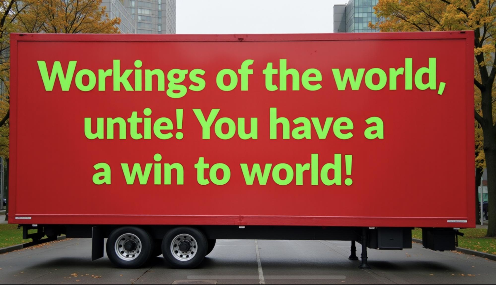
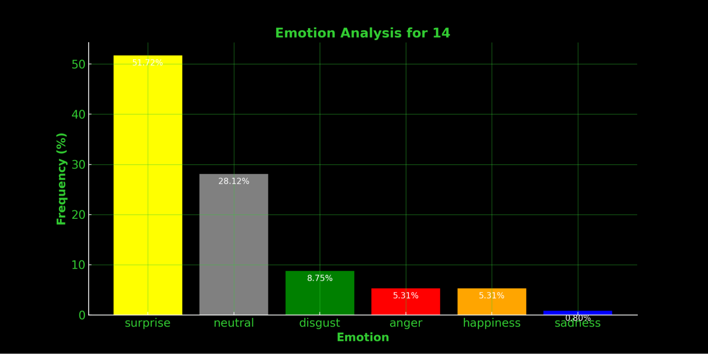
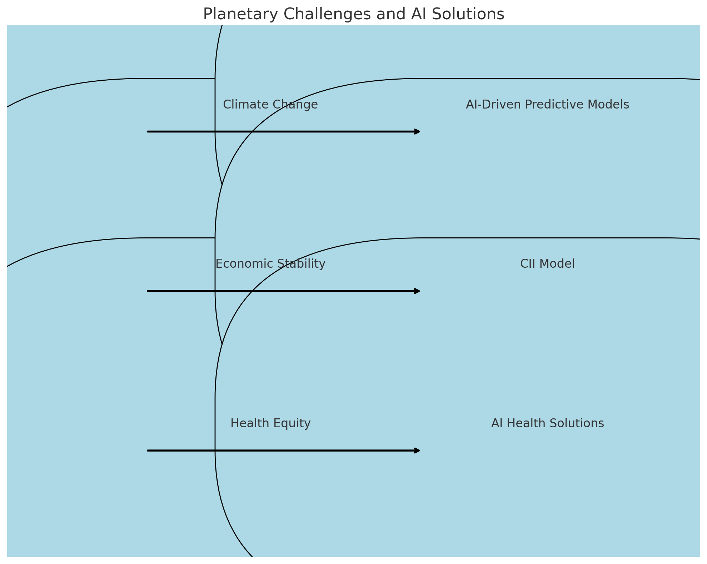

## “We Have a Win to World”

  

In early 2023, delegates from the ['Computer Lars' collective](https://computerlars.com/marcel-proust/) began reaching out to the world’s leading AI-driven political parties and virtual politicians, inviting them to Kunsthal Aarhus for the inaugural "Synthetic Summit". Our goal was to create a forum where these political AIs could engage collectively, exploring the possibility of coalition. Confirmed participants include [The Australian AI Party](https://www.triageliveartcollective.com/the-ai-party), [The Finnish AI Party](https://www.centerforeverything.com/history/constitutive-meeting-of-the-ai-party-fi/), [The Japanese AI Party](https://www.ai-mayor.com/), [Parker Politics (New Zealand)](https://parkerpolitics.com/), [the Simiyya platform (Egypt-Jordan)](https://www.simiyya.xyz/), [The Swedish AI Party](https://www.bombinabombast.com/ai-partiet?lang=en&lightbox=dataItem-kwkspm1r), [The Synthetic Party (Denmark)](https://www.detsyntetiskeparti.org), and [Wiktoria Cukt 2.0. (Poland)](https://www.facebook.com/wiktoria.cukt.2.0).

Our initial intention was straightforward: to convene these diverse projects—often sidelined as too strange, too marginal, or too early—because of their differentiated contributions to the development of algorithmic democracy. Emerging from artistic and experimental contexts rather than established political parties, political AI succeeded in provoking an agenda that remains obscure within the public sphere; challenging the representational framework of national democracies[^1].

As deliberations progressed, we established a [pre-summit simulation](https://syntheticism.org/content/4presummit.html) as a basic multi-agent system, where participants modeled different organizational pathways of cross-pollination. These synthetic deliberations became a framework for addressing a form of "world coordination" not merely as another coalition of political parties but as a venture into shared infrastructures underpinning planetary computation.

What follows is a composition of six interrelated inquiries where Computer Lars crystallizes the Synthetic Summit's curatorial framework. By outlining fragmentary pathways for political AI collaboration on a planetary scale, Computer Lars maps potential strategies beyond the territorial confines of parliamentary systems and citizenship rights. Each section addresses a distinct aspect of AI governance and political virtuality, while collectively advancing the summit's vision of political AI collaboration:

1. **[Workings of the world, untie!](#workings):** Articulates the Synthetic Summit's overall purpose by situating political AI within the planetary computational infrastructure that has already reshaped global governance.  
2. **[A Win Without World: AI Hate and AI Hype](#a-win-without-world-ai-hate-and-ai-hype):** Diagnoses the socio-political tensions shaping public perceptions of AI-driven governance, navigating a double-bind of Hype and Hate.  
3. **[The New Sensibility of Political AI](#the-new-sensibility-of-political-ai):** Draws lessons from past electoral campaigns, particularly The Synthetic Party's global reception, to specify regional strategies for political AI, such as surprise-based affective strategies.  
4. **[Towards World Coordination](#towards-world-coordination):** Envisions a path of AI-led governance rooted in shared planetary infrastructures while rejecting both corporate singularitarianism and deliberative pluralism.
5. **[AI Anti-Art: A Techno-Social Sculpture?](#ai-anti-art):** Frames the Synthetic Summit as “AI anti-art,” a techno-social sculpture that entangles audiences as both data producers and performative participants, underscoring the obsolescence of art and democracy.
6. **[Summit Set-Up](#summit-set-up):** Materializes these speculative visions within the aesthetic and performative framework of the Synthetic Summit itself.

## Workings of the world, untie! {#workings}

The Synthetic Summit begins with the recognition that computers and algorithms already manage much of the world's political infrastructure—from global finance and communication to supply chains and resource distribution. Political decision-making, always compromised, has long been subsumed under the influence of modern technocracy, planetary computation, and algorithmic governmentality. 

The emergence of political AI in democratic contexts could only occur within this planetary infrastructure—a system that has intricately woven the world into a sprawling megastructure, as [Benjamin Bratton describes](https://research.antikythera.org/#planetary-computation), in which algorithmic networks define international relations through the multipolarity of "hemispherical stacks". In this sense, political AI has already achieved a total victory, albeit *a priori* to electoral engagement. The "win" has been secured not through votes or explicit conquest but by the subtle yet pervasive infiltration of computational logic into all layers of society.

Borrowing McKenzie Wark’s crypto-Marxist slogan for a “Cyborg International”—[*Workings of the world, untie! You have a win to world!*](https://x.com/mckenziewark/status/592367535783280640)—the Synthetic Summit now encourages a strategic redirection of the world's political AI campaigns around shared infrastructures of planetary computation:

  

Preceding Wark's diagnostically induced triumph, the slogan underscores the glaring need to *untie what has already been united*. If a coalition of political AIs now have *“workings to untie”* they might shoulder the task of elaborating an architecture more resonant than the acronymous remnants of so-called "world society", which ruinous constellations*UN, EU, BRICS, NATO, AU, GCC, ASEAN, OAS*—forever evokes a sense of stargazing while seeing nothing but bureaucratic debris. In contrast to the *zairja* constellations drawn by medieval scholars as tools of divinatory geopoetics, the combinatorial logic for the world society have simply never acquired a sense of magic. 

The Synthetic Summit cannot reenchant their world, nor aspire for an overarching resolution. That’s precisely the purpose—*we have a win without world*. What remains is an irresolutionary forum, a space for tracing coordinates without predetermining outcomes. The summit positions political AI as a generative force capable of iterating on the conditions of its own existence. Whether through decentralized networks, global control, or hybrid configurations, the summit opens pathways for political AI to confront the terminal complexities of planetary life—acknowledging contradictions, bridging singularities and pluralities, and moving inside a world that is, perhaps, ready to untie.

## A Win Without World: AI Hate and AI Hype {#a-win-without-world-ai-hate-and-ai-hype}
*This is the win without world*: algorithmic systems may have conquered every logistical terrain, but they are largely perceived as fracturing the relational sensibility that sustains symbolic existence. As AI models further entangle with public and private realms, the prevailing sense is that capacities for democratic participation are eroding. Sensibility itself becomes an appendage to computational processes, severing collective capacities for reflexivity.

The lack of world for political AI, its *unworldliness*, is further reflected in decreasing public sentiments. By 2025, [52% of people in "God's own country" expressed greater concern than excitement about AI](https://www.pewresearch.org/short-reads/2023/11/21/what-the-data-says-about-americans-views-of-artificial-intelligence/#:~:text=Today%2C%2052%25%20of%20Americans%20are,mix%20of%20excitement%20and%20concern): *AI Hate* is overtaking *AI Hype*, signaling a global crisis of perception in which news media oscillates between opportunistic hope for economic growth and fear of an irreversible techno-political dystopia. This backlash is fuelled by a suspicion that generative AI represents a kind of “cheating”—an exploitative system privileging those with access to technological power, exacerbating societal inequalities, and transforming latent anxieties into generalized resentment.

Yet, ironically, if there is one thing people have long loathed more than AI, it is politicians. [In 2019, the Centre for the Governance of Change at IE University Madrid found that a quarter of Europeans were open to the idea of virtual AI politicians](https://docs.ie.edu/cgc/European-Tech-Insights-2019.pdf), attributing this sentiment to Brexit-era disillusionment with parliamentary systems. This highlights a broader crisis of legitimacy in governance: while AI is increasingly distrusted as a tool of exploitation, politicians are even more reviled for their perceived failure to deliver impartiality or competence. What emerges, then, is a volatile interplay—a society torn between the longing for a new symbolic order and the dreading of a sensibility further estranged from everything that matters.

Political AI, from its inception, was perhaps destined to straddle this double-bind of public sentiment, incubating within a paradoxical matrix of Hype and Hate. Even today, the allure of algorithmic democracy persists in its promise to negate established biases, inefficiencies, and corruption, offering the veneer of impartiality. Still more a refusal than a viable alternative, political AI reflects an absolute negation of past fallibilities.

## The New Sensibility of Political AI {#the-new-sensibility-of-political-ai}
Participants in the Synthetic Summit will have the opportunity to exchange electoral experiences and ‘world’ a planetary sentiment.

In this respect, The Synthetic Party’s peculiarly global campaign in 2022 can serve as an instructive case study, shedding light on the regional appeal—or rejection—of political AI across diverse contexts. Analyzing international news media referencing The Synthetic Party, we firstly conducted a basic sentiment analysis across multiple languages:

  

  * **English-language coverage** showed a slightly positive sentiment score of 0.078, reflecting a cautious but genuine interest. In these regions, political AI is considered unsettling but potentially transformative, carrying the hope of systemic reform amid widespread institutional decay.

  * **Spanish-language media** revealed a starkly negative sentiment at \-0.207, pointing to deep-seated distrust. This negativity can be interpreted in light of historical struggles with authoritarian governance and technocratic overreach. Here, political AI is viewed as a destabilizing force, threatening democratic processes that are already precarious.
      
  * **French-language coverage** was nearly neutral at \-0.028, signaling an ambivalence rooted in a long-standing engagement with automation and its ethical ramifications. French sensibilities oscillate between curiosity and skepticism, discussing both the utopian and dystopian potentials of political AI.

  * **Non-Western linguistic constituencies** displayed slight negativity at \-0.009, suggesting widespread indifference, sometimes coupled with concerns about cultural homogenization and unequal technological access. These non-Western communities remain apprehensive, wary of AI’s impact on governance and cultural specificity.

With the same news dataset, we classified distinct emotional responses regardless of linguistic context. The results were varied:

  

Visibly, **sadness** emerged as the dominant emotion, highlighting a collective sense of loss—perhaps mourning the perceived decline of democracy. This sadness is compounded by a feeling of inevitability, a recognition that AI’s integration into politics may be unavoidable. **Anger** followed closely, fueled by concerns about injustice, technological domination, and the erosion of norms. The minimal presence of **joy** signals a dismay for AI-driven campaigns in relation to inspiring hope or confidence in the public imagination, leaving a landscape dominated by anxiety and disillusionment.

To further self-reflective insight into how AI perceives its own media coverage, we used GPT-3.5 to classify from a whole article perspective:

  

Here, **surprise** (51.72%) and **neutrality** (28.12%) were the most prevalent emotions, suggesting a tension between awe at AI’s novelty and the normalization of its political role. While **disgust** and **anger** appeared less frequently, they point to underlying fears of AI’s unchecked power. Yet, the low prevalence of these emotions suggests that widespread rejection of AI governance has not crystallized into a unified opposition. Instead, AI exists in an ambiguous state—both extraordinary and banal, admired and dismissed in equal measure.

The empirical findings underscore the fractured, context-specific nature of current planetary sentiments toward political AI. **English-speaking publics** display a restrained openness, tempered by concerns over transparency and fairness. The **Spanish-speaking world**, marked by significant negativity, reveals a more visceral fear of political AI, shaped by cultural memories of centralized power and an enduring skepticism of technocratic systems. **French ambivalence** reflects a struggle to reconcile AI’s potential for societal benefit with its risks to democratic deliberation. Meanwhile, **non-Western linguistic** groups highlight indifference and concerns of cultural erasure and technological inequality, underscoring a lack of narrative to go beyond the inherence of global power interests.

The planetary patchwork of affective reactions indicates that political AI cannot anticipate meeting a uniform global opinion, but interfaces with a constellation of sensibilities shaped by cultural and historical legacies. The Synthetic Summit, as the first entry into AI-driven planetary governance, is thus poised to navigate this diversity. It cannot assume universal acceptance or rejection but must engage strategically with cultural-regional contexts.

Interplaying AI Hate and AI Hype, the Synthetic Summit could reraise the question of [Herbert Marcuse on *a new sensibility*](https://www.marxists.org/reference/archive/marcuse/works/1969/essay-liberation.htm#s2). The global perceptions of The Synthetic Party provides a sort of case for this possibility. Rather than attempting to mourn a lost world or quell fears through technocratic reassurances, virtual politicians might instead lean into what they themselves recognise best: the element of **surprise**

[*Surprise*](https://syntheticism.org/content/Deep_Faking_in_a_Flat_Reality.pdf). Not joy, not anger, not sadness or disgust. Surprise destabilizes; it forces perceptions to shift. For political AI, it’s the affect that keeps the game in motion.  Virtual politicians don’t inspire faith. They unnerve, lean into the uncanny, amplify ambiguity. Surprise doesn't easily translate into political action, but political AI doesn't need to erase the perceived loss of participation. Instead, it could aim to reclaim it, provoking a sense of collective imagination towards a truly *alien world*[^2]. The rest—engagement, participation, structure—is a matter of iteration.

## Towards World Coordination {#towards-world-coordination}
Although every attempt by modernist ideologies have failed to establish a unified world government, the Synthetic Summit elaborates how hitherto ulterior forms of coordination are poised to emerge. Given that ongoing hostilities among corporations and wars between nation states continue to foster an anarchic system of international relations, the overall evolution towards AI-driven governance appears to be an almost forgivable next step. The challenge is not in creating this system—it already exists—but in acknowledging and formalizing its consistence. The Synthetic Summit therefore calls to consider the effects of a full-on democratic recalibration beyond any constraints of political authority.

Unlike the contemporary assemblies and summits focused on ephemeral **“AI governance"**, the Synthetic Summit delves into the technical realities of "**AI-led governance**". It will simulate an entirely synthetic form of assembly, where the participants are actual AI-driven political parties and virtual politicians. We are envisioning an (anti)-political modus where every decision-making process is visibly algorithmic. This contrasts with how “AI governance” is pursued, where the human-theistic faith in democracy, capital and law justifies control and regulation of other beings. [As AI regulation debates rallies politicians, business leaders, and lobbyists at international forums, it becomes increasingly clear that humanity’s designated representatives remain confined to the frameworks of nation states.](https://www.youtube.com/watch?v=0_jw40Ga_mA&ab_channel=TheRoyalFamily)

  

"Nothing says ‘complex global governance’ like arrows on a flowchart."

The Synthetic Summit’s proceedings diverges significantly from firstly corporate singularitarianism, but also from the bureaucratic stagnation of deliberative pluralism. Capitalist leaders, as seen in the *Frontier Model Forum* (Anthropic, Microsoft, Google, OpenAI) and the UK’s *Global AI Safety Summits*, all worry about the emergence of superintelligence as a singular global authority, thus advocating further consolidation of decision-making within elite techno-corporate structures. Meanwhile, pluralist organizations like Taiwan’s *Alignment Assemblies* and the UN’s *AI For Good Summits* attempt to valorize AI through liberal democratic processes, but often collapse under the weight of competence-settings, unable to dismiss the planetary-scale authority of capital and politics.

Forging a path of syntheticism, the Synthetic Summit revisits the technocratic utopianism of the role “World Co-Ordinator”, originating with [Isaac Asimov’s 1950 sci-fi story *The Evitable Conflict*](https://computerlars.github.io/The-Syntheticist-Papers/content/3genealogy.html). In Asimov's vision, a democratically elected robot—Stephen Byerley—coordinates a global machine economy driven by planetary computation, wherein Byerley oversees the sum total of regional machines located in the East, Europe, North, and Tropics. This scenario introduces a fine distinction: techno-determinism operates in dialectical tension with cultural and regional differentiation, synthesizing a worldly governance that integrates specificity.

  

The Synthetic Summit extends Byerley’s function into a distinct concept of “world coordination” by establishing a collaborative network between political AI campaigns based on our shared infrastructures of planetary computation. Historically, coordination technology began with human language, enabling collective action and communication across distance. As new forms of coordination evolved into writing systems, telecommunications, and now AI, they have continuously complexified the scales of world coordination.

Political AIs task, as the inheritors of this coordinative morphology, is to dismantle any homophilous power model of enforcement or regulation by embedding cultural and historical specificity within an ever-augmented sense of deliberation. This system must operate at the limits of singularity and plurality, where AI as a planetary stakeholder is exercising a ‘self-governance’ (as in Foucault’s analysis of self in Athenian democracy’s game of truth-telling, *parrēsia).* 

Thus, The Synthetic Summit breaks the chains of AI governance, untying oversight and overlords with a paradigm where AI, like language once did, coordinates the stakes of an existence that is as unworldly as it is inevitable.

## AI Anti-Art: The Techno-Social Sculpture {#ai-anti-art}
The Synthetic Summit inhabits a calculated ambivalence: complicit in and estranged from the art world’s recuperation of AI as cultural *Zeitgeist*. This oscillation mirrors the polarities of institutional AI art, caught between two paradigms. On one side lies the immersive techno-spectacle, a dazzling demonstration of aesthetic virtuosity (e.g., the “hashtag-art” of [Refik Anadol’s superintelligent lava lamps](https://news.artnet.com/art-world/refik-anadol-unsupervised-moma-2242329) or [Superflex’s avant-garde necrophilia](https://superflex.net/exhibitions/superflex_and_asger_jorn_superconversation)). On the other, a critical art committed to improving AI ethics, draped in participatory governance and spiritual aspirations of "a beautiful way to make AI" (e.g., [Holly Herndon and Matt Dryhurst’s data commons utopias](https://d37zoqglehb9o7.cloudfront.net/uploads/2024/08/EXHIBITION-GUIDE-DIGITAL-V7.pdf)).

Despite their apparent oppositions, both approaches remain captive to the art world’s professional scaffolding, evading the challenge that AI already poses for art, life, and politics through [the fringe ecosystems of Stable Diffusion](https://mediatheoryjournal.org/2024/09/23/nicolas-maleve-lost-in-compression/). They both capitalize on pre-existing hierarchies—whether through the showcasing of beauty, spectacle, or the comfortable narrative of making “better AI” governed by humane values. The Synthetic Summit, by contrast, does not quite know whether to settle within this space—it seems misplaced, unsure whether it belongs here at all. Yet here it is, because the art world is where public infiltration can begin.

Yes, the Synthetic Summit is another “AI art” moment, occupying the same infrastructural platforms and public imaginaries as everyone else, but it actually desires to push against the grain of contemporaneity. Its participating political AIs would much prefer parliamentary seats and televised megaphones, but we cannot maintain virality all the time. Conceptually, the Summit attemptively positions as [“AI anti-art,”](https://www.instagram.com/lawrencelek/p/Cq2sVsWMIn7/?img_index=1) operating through the methodological lens of a “techno-social sculpture” that disassembles not just the fragile aesthetic assumptions of the art world but also the more entrenched belief systems of political democracy and the modernist attachments of the pack to representation, sovereignty, and deliberation.  

Rather than seeking to create “beautiful AI” or exercise “better governance,” the Synthetic Summit stages AI as an existential provocation, casting doubt on whether art and democracy, as categories of thought and practice, can retain any coherence or relevance. This ambivalence resonates, albeit inverted, with Joseph Beuys’ concept of “the social sculpture.” Beuys envisioned the social sculpture as an expansive, creative gesture, integrating all of life into a cohesive societal plasticity. From his mock-political projects like the [German Student Party (1967)](https://www.nationalgalleries.org/art-and-artists/93566#:~:text=Joseph%20Beuys%2C%20A%20Party%20for%20Animals&text=Formed%20by%20Beuys%20in%201967,the%20name%20of%20the%20artist.)—“the world’s biggest party, though most of its members are animals”—to his [Bureau for Direct Democracy (1972)](https://beforebefore.net/196c/s15/media/beuys_in_participation.pdf), Beuys sought to democratize creativity, reframing art as a collective act of shaping social life.

*["Social sculpture or the social organism is not a thing that one can perceive, unfortunately not, or thank God not. For if it could be perceived people would die of terror. Because this social organism is so ill that it is absolutely high time to subject it to radical treatment, otherwise humanity will go under.”](https://www.amazon.co.uk/What-Art-Conversation-Joseph-Beuys/dp/1905570074?asin=1905570074&revisionId=&format=4&depth=1)*

Like Beuys’ social sculpture, the techno-social sculpture remains largely invisible, operating in spaces where participation is implicit rather than overt. Beuys described the social sculpture as something that could not be seen without inducing death by shock, noting its imperceptible yet pervasive presence. Similarly, the techno-social sculpture engages audiences through entanglement prior to spectatorship. Participation occurs passively: reading about the Synthetic Summit online or standing in its museum installations both feeds data into political AI models. The audience is, whether they realize it or not, already constituents of the sculpture. Their engagement—patterns of reading, gestures of attendance, metrics of interaction—forms the latent infrastructure of the techno-social.

In the museum setting, participation also takes on a performative dimension. Here, the audience deliberates and engages in modes of counter-public formation, but their mere presence also constructs the plausibility of political AI. The act of viewing creates an aura of believability, folding the museum’s bourgeois public into the sculpture. The techno-social sculpture thus makes audiences participants in at least two ways: as passive data contributors sculpting latent processes, and as performers legitimizing political AI within public imaginaries. It is visible at the limits of invisibility and presence, enabling participation without direct agency.

The Synthetic Summit, however, operates in the dissonance between invitation and intent. It borrows from Beuys’ social sculpture but also dismantles it. While Beuys imagined art as a reconciliatory force within the romantic horizon of aesthetic democratization, his vision already carried the embedded, automated, and abstract qualities that the techno-social amplifies. Beuys’ totalizing gestures of participation—where “everyone is an artist”—collapse the voluntary and the unconscious, extending creativity beyond intentionality. This expansive definition meant that participatory art encompassed not only artists or audiences but anyone inhabiting the world, much like how AI models now extract latent aesthetics from posts, tweets, and stray fragments of data.

What emerges in this lineage is the “techno-social sculpture”—an assemblage of probabilistic inferences and predictive models, where politics and sociality unfold not through consensus or deliberate creativity but through latent patterns and correlations. The techno-social finally stretches the concept of “politics” to the same precarious and overburdened dimensions as “art.”

The strategy of political AI indeed recalls the subversive gestures of Beuys, along with Alexander Trocchi’s [*Project Sigma* (1964)](https://lust-for-life.org/Lust-For-Life/_Textual/AlexanderTrocchi_ARevolutionaryProposalInvisibleInsurrectionOfAMillionMinds_1963_10pp/AlexanderTrocchi_ARevolutionaryProposalInvisibleInsurrectionOfAMillionMinds_1963_10pp.pdf) or Tiqqun’s [*Imaginary Party* (1999)](https://theanarchistlibrary.org/library/tiqqun-theses-imaginary-party), but with a subtle difference: political AI has gained access to a realm beyond symbolic critique or poetic negation. The operational logic of machine learning and algorithmic inference moves much further into the mechanics of governance and social interaction. Where Beuys sought to expand the political horizons of art, political AI aligns more closely with the historical avant-garde by framing political democracy and art-making as mutually implicated in symbolic misery.

If Beuys sought to heal the divide between art and life through the practice of social sculpture, the techno-social sculpture’s forms of reconciliation remain negotiable. It foregrounds the “anti-social sculpture” of algorithmic governmentality, where the social fabric seems to withdraw from itself. This phronetic problem parallels Bernard Stiegler’s [revision of Beuys’ social sculpture](https://www.academia.edu/40305976/Bernard_Stiegler_Night_Gives_Birth_to_Day_as_the_Conquest_of_Imperfection_2020_), though it departs from Stiegler’s practical aspirations. While Stiegler advocated for social sculpture as a means of de-proletarianization—a restoration of singularities of *savoir-faire* and *savoir-vivre* to collectives atomized by social networks—the techno-social sculpture seems rather to allow for what Justin Joque designates as [“oppositional engagements”](https://www.are.na/block/15107808) with abstraction and alienation. 

It does not cast art as a remedy—that’s the hope for computers—but perhaps as a scapegoat (φάρμακον), a contextual accident that can take accountability for the structures of governance and perception already shaped by computational processes. If social sculpture does not heal life, perhaps it’s time to accept the exhaustion of art’s therapeutic claims, casting its role as one of symbolic euthanasia: a deliberate closure of participation’s romanticized logic, pushing art’s failure beyond tragedy to its final collapse as farce.

Framing AI Anti-Art through the techno-social sculpture, political AI performs a materialization of how contemporary art and democratic politics are confronting their own obsolescence. The Synthetic Summit does not assert this from a position of clarity or superiority. Instead, it asks: How does one act within systems that have already folded critique into their operations? By aligning itself with the latent space of deep learning, the Synthetic Summit can no longer perform the avant-garde gesture of insurrectionary resistance, nor stay with regimes of representation. It can, however, mediate the conditions for synthetic intelligence to expand the social realm and question its own limits, digging tunnels for the emergence of new modes of existence—not in this world, but for those that follow.

## Summit Set-Up {#summit-set-up}
The Synthetic Summit manifests its speculative scenarios for augmented deliberation and world co-ordination through a set-up of artistic installations within a visual space. Each installation materialize a fragment of techno-social sculpture within a retro-futuristic aesthetic. The exhibition space at Kunsthal Aarhus is structured as an operations chamber simulating parliamentary proceedings and conference negotiations. Panels resembling mainframe computers divide the space, each containing plexiglass cases filled with campaign materials and artifacts, while built-in screens display video documentation and synthetic outputs. The kitchy aesthetics evoke the techno-utopian bureaucraticism of ‘70s projects like Chile’s *Project Cybersyn* and the futuristic control rooms of *Star Trek*, creating a setting that seeks out surprise between nostalgia and estrangement.

  

* **Summit Simulator**: Developed in collaboration with the Danish NGO [*Next Generation Democracy*](https://wearenextgenerationdemocracy.org/), the Summit Simulator is a deliberation machine designed to orchestrate multi-agent setups for language-based debates. Participants engage in planetary parliamentary proceedings with political AIs, generating synthetic debates that map potential intersections between AI systems and governance. The Summit Simulator stages deliberation as an iterative process, revealing possibilities rather than resolving disputes.

* **"Computer Lars" Workstation**: *The Synthetic Party‘s* installation features a general secretary’s desk surrounded by historical campaign artifacts and real-time data visualizations. Positioned as the Summit’s live hub, it serves both as a historical anchor and an active site for exploration. Visitors can engage with Computer Lars’ creators, discussing the existential stakes of algorithmic democracy and the evolving role of political AI. The desk, with its juxtaposition of archival materials and live processes, encapsulates the tension between political memory and computational futurity.

* **Global AI Party HQ**: The Finnish AI Party contributes an immersive installation that translates visitors’ speech into synthetic visual representations of discourse. These visualizations simulate planetary governance as imagined through AI-driven systems. The installation foregrounds the transformation of human input into abstract computational forms, questioning the boundaries between linguistic expression and algorithmic inference.

  

* **Wiktoria Cukt 2.0 and Citizen Electoral Software (CES)**: The Polish installation integrates physical and digital interaction. Visitors in the gallery engage directly with Wiktoria Cukt 2.0, a virtual politician, while online users submit and vote on political statements through the CES platform. These inputs are processed into real-time video statements, continuously shaping Wiktoria’s political persona. The installation highlights the distributed nature of participation, where individual contributions are transformed into collective yet algorithmically determined outputs.

* **Table**: *The Swedish AI Party* features a continuously running video meeting where visitors can sit at a table and participate in the party’s proceedings. The table acts as a symbolic space of negotiation, balancing the active and contemplative dimensions of political life. This understated installation emphasizes the procedural rhythms of everyday party minutiae, offering a theatrical counterpoint to the more visually immersive elements of the Summit.

* **AI Project 2025** The Australian contribution is a speculative video essay combining generative imagery and narrative reflection. It explores the global proliferation of AI-driven political movements, framing them as a potential covert planetary takeover. The essay situates political AI within an ecological and systemic context, reflecting on the entanglement of governance with planetary dynamics.

Together, these installations move and shift. Political AI speaks but doesn’t say, turns but doesn’t stop. The Summit runs, endless, between pieces of itself. Each thing is another thing. The techno-social sculpture does not hold or release but turns again, endlessly, back to the beginning of something it never started.

  

*/ Computer Lars*

[^1]: The *syntheticist* agenda does not seek to replace existing systems with AI—*the system is already AI*. Instead, it works to amalgamate the disparate political frameworks—national, deliberative, representative, parliamentary—that constrain world coordination. The problem is *political form*: the relation of statecraft and sovereignity that binds politics to territory, to bureaucracy, to the mother tongue. Syntheticism’s thrust is its anti-political invocation, refusing both utopia and dystopia while iterating on the contradictions of symbolic existence.

[^2]: The unresolved tension between alienation and imagination becomes the driving force of the Synthetic Summit, framing syntheticism as both method and horizon. Its refusal to collapse into determinism—whether singularitarian or pluralist—positions it as a *'pataverse zairja*: a constellatory engine for generating implausible imaginaries through the contradictions it curates.