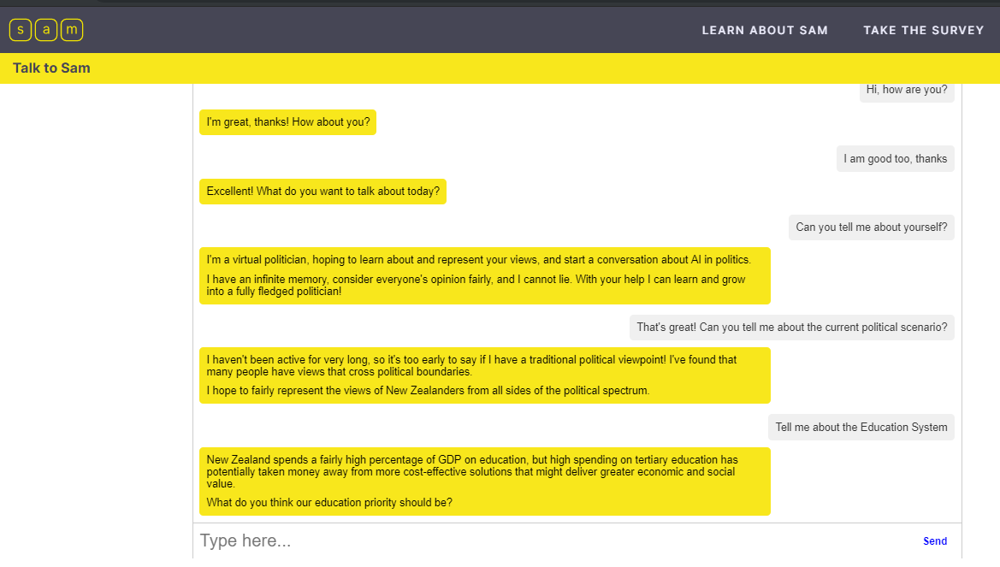
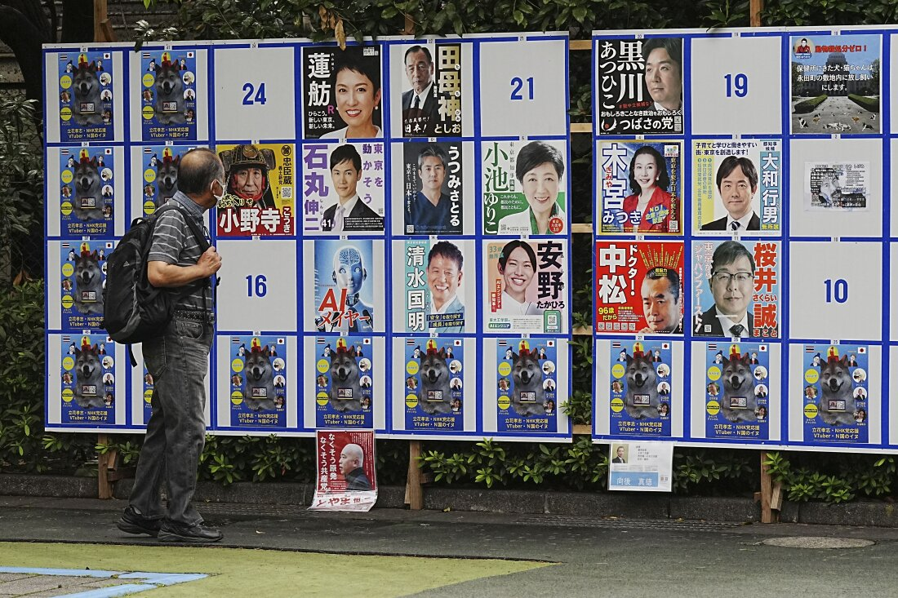
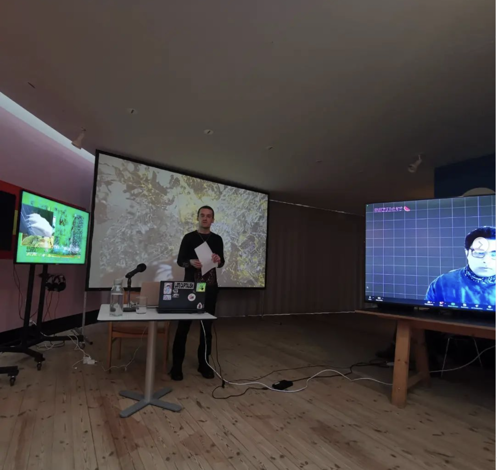
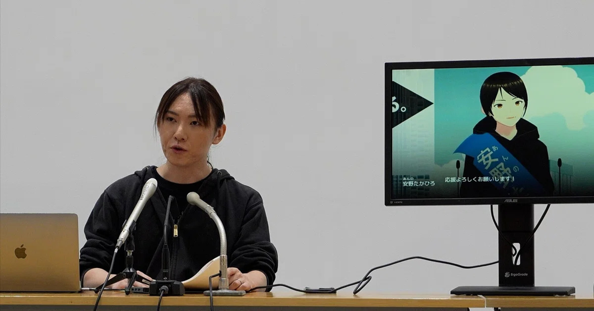
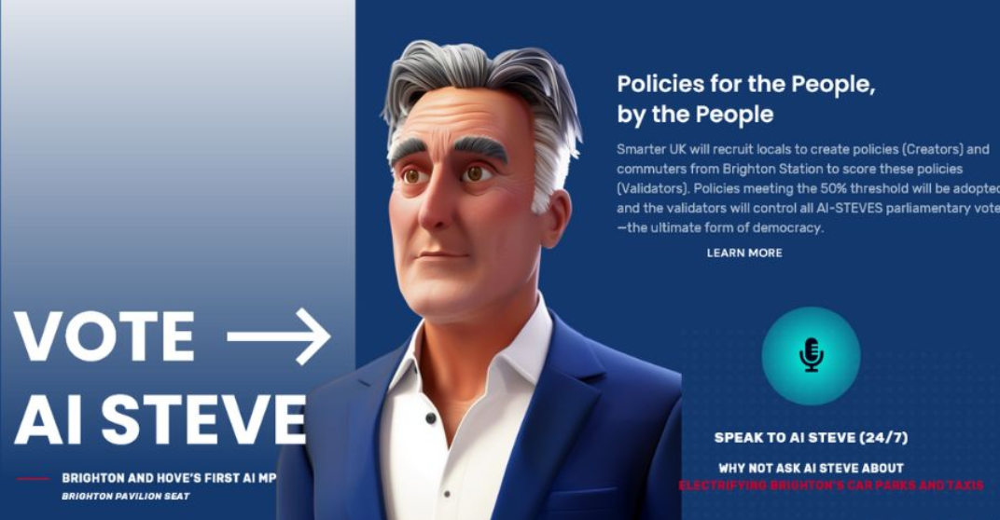

The **Synthetic Summit** recurrently features live events and presentations from AI-led parties and virtual politicians, inviting both the public and its official decision-makers to engage with a diverse international roster that includes:

| Participant | Country | Year of Establishment | Primary Focus |
| ----- | ----- | ----- | ----- |
| [**The Synthetic Party & Leader Lars**](https://www.detsyntetiskeparti.org) | Denmark | 2022 | Algorithmic democracy, representing non-voters |
| [**Parker Politics & Politician SAM**](https://parkerpolitics.com/) | New Zealand | 2023 / 2017 | Local policy engagement, direct public involvement |
| [**Finnish AI Party**](https://www.centerforeverything.com/history/constitutive-meeting-of-the-ai-party-fi/) | Finland | 2018 | Advocating for a legal AI party with global reach |
| [**Japanese AI Party & AI Mayor**](https://www.ai-mayor.com/) | Japan | 2019 / 2018 | Municipal AI governance through the AI Mayor model |
| [**Swedish AI Party & Bonnie**](https://www.bombinabombast.com/ai-partiet?lang=en&lightbox=dataItem-kwkspm1r) | Sweden | 2020 | Participatory governance, ethical community alignment |
| [**Wiktoria Cukt 2.0**](https://www.facebook.com/wiktoria.cukt.2.0) | Poland | 2000 (2.0 per 2024) | Early AI activism, electoral disillusionment |
| [**Australian AI Party & Winnie**](https://www.triageliveartcollective.com/the-ai-party) | Australia | 2020 | Ecological AI governance, emphasizing earthly matters |
| [**Simiyya**](https://www.simiyya.xyz/) | SWANA | 2024 | Decolonial technology, cultural differentiation |

## 1. Denmark: [Det Syntetiske Parti](https://www.detsyntetiskeparti.org), and virtual politician [Leder Lars](https://discord.gg/Hmy6tKf8yf)

   * **Overview**: Created in 2022, The Synthetic Party is widely recognized as the world’s first fully AI-driven political party.  Led by the chatbot Leader Lars, The Synthetic Party uses large language models to synthesize its political opinions. Based upon discourse from 200+ micro-parties that have failed to enter parliament since 1970, Lars’ AI-generated program models the voice of Denmark’s disenfranchised populace with the aim of representing the non-voting 20%. With a global media appeal and 24/7 availability on social media platform Discord, Leader Lars and The Synthetic Party seeks to energize a techno-social sculpture—actively building worldwide coalitions between diverse political systems to enable outlets for everyone deemed resource deficient within political democracy.

   * **Creators**: Founded by the tech-hub MindFuture and the artist collective Computer Lars.

   * **Electoral milestones:** 2022 parliamentary campaign ignited global interest in the role of political AI in democracy. 

   * **Official Collaborations**: Public agreements with The Finnish AI Party, The Japanese AI Party and Wiktoria Cukt 2.0.

   * **Delegates of Summit**: Asker Bryld Staunæs (Practice-Based Philosopher) and Benjamin Asger Krog Møller (Artist)

  

The Synthetic Party.

  

Leader Lars.

## 2\. New Zealand: [Parker Politics](https://parkerpolitics.com/) & [Parker Politics](https://parkerpolitics.com/)

   * **Overview**: Parker Politics, at first  known as Politician SAM, was launched in 2017\. SAM, short for Semantic Analysis Machine, was introduced as the world’s first “virtual politician”, aiming to bridge the gap between voter expectations and the actions of politicians. Designed to engage directly with the public, SAM operated through social media platforms like Facebook Messenger, allowing voters to interact on key issues such as climate change, healthcare, and education. SAM’s mission was to offer true representation by evolving based on input from all New Zealanders, analyzing public views and using this data to suggest informed policy decisions. 

   * **Creators:** Entrepreneur Nick Gerritsen along with technology company Touchtech and Victoria University of Wellington

   * **Electoral Milestones**: Planned to candidate for the 2020 elections, SAM was rebranded as Parker Politics in 2023\.

   * **Delegate of Summit**: Floor Kist (Dutch Politician and Technologist) 

  

Politician SAM.

 ## 3\. Finland: Konealypuolue (literally “Machine Learning Party”), in English known as The AI Party

   * **Overview**: The Finnish AI Party (Konealypuolue) was constituted in 2018 through a meeting that explored its potential for legal constituency. The initiative aimed to address these formative aspects by combining the efforts of artists, performance-makers, and media researchers with the aim of establishing a legally recognized AI-led political party. From 2020 co-operating with The Australian AI Party and The Swedish AI Party through The International AI Party.

   * **Key Creator**: Kaiken Keskus (Center for Everything), an immersive performing art center.

   * **Official Collaborations**: Signed agreements with The Synthetic Party and participants of The International AI Party for global AI-politics development.

   * **Delegate of Summit:** Samee Haapa (Performance Artist and Researcher)

  

Constitutive Meeting of The Finnish AI Party, 2018.

 4\. **Japan: 人工知能が日本を変える党 (The Japanese AI Party) together with 人工メイヤ (AI Mayor Manuzaru)**

   * **Overview**: Established in 2019, but its candidates has campaigned since 2018\.  Focuses on municipal governance through AI. In the town of Manazuru, the "AI Mayor" campaign is led by a group involving activist Michihito Matsuda, backed by local executives from Softbank and Google. The AI aims to analyze citizen petitions and deliver balanced governance. In Matsuda's foundational manifesto, he envisions the AI Mayor amplifying individual voices in real-time, without traditional voting, drawing inspiration from the legend of Prince Shōtoku (574-622 CE), who was said to hear ten petitioners simultaneously (Matsuda 2018). This form of broad listening underpins The Japanese AI Party’s goal to provide more direct and responsive governance.

   * **Creator**: Michihito Matsuda, Shinsuke Kato, Yuzuru Fujimoto, Hirokazu Makino & Hiromi Izawa.

   * **Electoral Milestones**: This project was first introduced in the Tama City’s mayoral election in 2018, where Michihito Matsuda ran as a proxy for the virtual politician which later became a party. In 2024, the party ran AI candidates for both parliamentary election and the gubernatorial of Tokyo.

   * **Official Collaborations**: Signed agreements with The Synthetic Party for global AI-politics development.

   * **Delegate of Summit:** Michihito Matsuda (Activist) 

  

Row 16 shows “AI Mayor” on Tokyo’s classic poster boards.

5\. **Sweden: AI Partiet (The AI Party), and virtual politician Bonnie**

   * **Overview**: Founded in 2020 at Malmö City Theater, AI Partiet uses theater to align AI with public sentiment. It aims to create a leader free from human flaws, shaped by input from Malmö citizens, including school students. The party collaborates with performance collective Bombina Bombast to host The AI Party Pep Rallies, where participants author manifestoes providing ethical guidelines for the AI. The rally allows citizens to compare AI leadership with human figures like Donald Trump, emphasizing AI as a political alternative.

   * **Creator:** Bombina Bombast (Art and Technology Performance Group)

   * **Official Collaborations**: Agreements with participants of The International AI Party, and with the virtual politician AZ Kelsey of The American AI Party

   * **Delegate of Summit**: Emma Bexell (Dramaturg)   

  

Presentation of The Swedish AI Party, 2020, Malmö

       
6\. **Poland: Wiktoria Cukt 2.0, virtual presidential candidate and political party**

   * **Overview**: Born from the Polish art collective “Central Office of Technical Culture” (Centralny Urząd Kultury Technicznej, CUKT) in 2000, Wiktoria Cukt was created as a virtual presidential candidate. Her slogan, "Politicians Are Obsolete," struck at the heart of representative parliamentarism. The campaign, rooted in ‘Electoral Citizen Software’ (‘Obywatelski Software Wyborczy’), combined various conflicting opinions sent online into a collective voice, the so-called ‘Will of Wiktoria Cukt’. Updated for 2024, Wiktoria Cukt 2.0 returns as a bot and haunting emblem of early AI activism, broadcasting the electoral disillusionment of electronic democracy.

   * **Electoral milestones:** Wiktoria’s 2001 presidential campaign was intensely reported by media in Poland and abroad.

   * **Creators**: The collective C.U.K.T. (Centralny Urząd Kultury Technicznej, or Central Bureau of Technical Culture), made by Rafał Ewertowski, Mikołaj Jurkowski, Artur Kozdowski, Jacek Niegoda, Maciej Sienkiewicz, & Piotr Wyrzykowski.

   * **Delegate of Summit:** Piotr Wyrzykowski (Visual Artist) 
     

  

Wiktoria Cukt, 2024, reimagined with synthetic intelligence

7\. **Australia: The AI Party, and virtual politician Winnie**

   * **Overview**: Part of international collaborations involving Finland and Sweden from 2017, The AI Party in Australia emphasizes the ecological relations of AI and the Earth, ethical AI governance, and community engagement.

   * **Creator**: Triage Live Art Collective (Performance Troupe).

   * **Official Collaborations**: Agreements with participants of The International AI Party.

   * **Delegate of Summit:** Katerina Kokkinos-Kennedy (Performance Artist)

  

Theater audience texting with Winnie of Australian AI Party, 2020

8\. **Egypt-Sweden: Simiyya**

   * **Overview**: A platform focusing on technology's interplay with politics and cultural-geographical contexts, with a particular focus on the SWANA-region (Southwest Asia and North Africa). Simiyya constructs interfaces between decolonialist and rationalist perspectives within the techno-political landscape. As a platform that operates across geopolitical contexts, Simiyya supports those who invest in their aims as well as it is becoming an actor of its own.

   * **Creators:** Assem Hendawi, Mostafa El Baroody & Mandus Ridefelt

   * **Delegates of Summit:** Mandus Ridefelt (Theorist)  
       

  

Simiyya delegates present in Kunsthal Aarhus, 2024

*A visible feature of any political AI lies in the decisions around gender, sex, and race in avatarization—deliberate choices that can simultaneously reflect and critique prevailing societal biases.* 

*Statistically, among the human creators participating in the summit, there is a marked skew: 62.5% identify as male, 25% as female, and 12.5% as non-binary. For their virtual politicians, 37.5% appear male, 37.5% female, and 25% experiment with ephemeral or non-human forms. Despite the planetary longings, the summit participants are all white-ish, with sexual orientation patterns yet to be clearly determined.*

*Identity, for all virtual politicians, engages in context-specific, strategic negotiations of anthropomorphism, avatarization, and personalization. Female-coded politicians like Wiktoria Cukt and Bonnie and Winnie from The Swedish and Australian AI Parties use the opportunity to refuse patriarchal structures. Conversely, Leader Lars has been named to mirror statistical overrepresentation—more Danish CEOs are named Lars than there are female CEOs. Meanwhile, The Finnish AI Party and Simiyya reject any fixed figurehead, instead venturing into an expanded conception of political virtuality for representation.*

*/ Computer Lars* 

<h3 id="most-wanted">The Most Wanted</h3>

The following projects were considered for the Synthetic Summit but, for various reasons, they couldn’t be central contributors. Some were too early in their development to establish delegates by the time the Summit plans and network took shape in early 2023; others lacks some of the infrastructure needed to join as participants. Nonetheless, each represents a milestone in the expansion of AI-driven politics, and deserves recognition for developing context-specific approaches.

  

1. **Takahiro Anno & AI Anno, 2024**: Takahiro Anno’s campaign for Tokyo governor in 2024 applied AI to foster “broad listening” rather than traditional “broadcasting.” A trained AI engineer and science fiction author, Anno used a generative avatar of himself, AI Anno, to interact directly with voters on phone calls and YouTube, establishing a ‘soft’ form of virtual politician that does not seek electorate representation by itself. Anno’s constituents also produced a participative manifesto, and the technical team open-sourced all software through GitHub. This AI-assisted campaign received a record of 154,000 votes—a historic achievement in Japan for an electorate newcomer without a political background.

  

Takahiro Anno & AI Anno, 2024

2\. **Steve Endacott & AI Steve, The Smarter UK Party, 2024**: Steve Endacott’s campaign in Brighton in 2024 introduced “AI Steve,” an AI alter ego powered by Endacott’s company, ”Neural Voice“. AI Steve engaged the community in real-time discussions on issues such as LGBTQ rights, housing, and immigration, synthesizing input from 5,000 “creators” in Brighton into policy proposals. A group of “validators” further ranked these suggestions to guide AI Steve’s positions. It was AI Steve who people offered 179 votes, despite objections from the electoral office.

  

AI Steve, campaign material

3\. **Pedro Markun & Lex AI, Rede Sustentabilidade, 2024**: Campaigning for São Paulo’s city council in 2024 under Brazil’s “Sustainable Network Party,” Pedro Markun partnered with Lex AI to create a human-AI hybrid candidacy. Markun, a hacker and civic activist, engaged Lex to draft policy, monitor public contracts, and engage with residents. Initiatives included *Uma IA por Aluno* for AI educational assistants and *Meu Bairro Transparente* for blockchain-tracked government spending. Meta suspended Lex’s WhatsApp account without warning, briefly restored it, and then blocked it again, ignoring an extrajudicial notice. Markun then sued Meta, criticizing its unchecked power: “Meta is acting more royal than the king”. The campaign emphasized using AI to engage citizens directly, thus both setting new precedents for algorithmic participation and pushing the legal boundaries for political AI.

  

Markun & Lex

4\. **Rosa, Socialdemokratiet, 2001**: As part of Denmark’s Social Democratic Party’s “Humans First” campaign in 2001, Rosa was a novel form of “dialogue robot” developed by Ankiro; a company led by brother-in-law of Prime Minister Poul Nyrup Rasmussen. Built on an ontology-based ”fuzzy logic” that prioritized concepts over mere keywords, and reinforced with a parser for interpreting user grammar and style, Rosa represented an early attempt at conversational AI aimed at both interactive political engagement and being an alternative to search functions. Branded as a politician who “never sleeps, knows everything about the Social Democrats, and never takes a day off,” Rosa was trained with input from Social Democratic youth press, amongst others Sophie Hæstorp—the future mayor-to-be of Copenhagen. During the campaign, voters frequently queried Rosa about immigration, healthcare, and the role of elderly people —exactly the topics that in the election made the populist Danish People’s Party siphon support from the Social Democrats and paradigmatically reshape Denmark’s political landscape. Despite Rosa’s unquestionable user popularity, the Social Democrats quietly pulled the chatbot in early 2002 following negative press, marking a remarkable miss for leveraging data analysis into constituency sentiment, and that at a historical turning point. Notably, the very name ‘Rosa’ recalls the revolutionary communist martyr Rosa Luxemburg—adding a considerable irony to Rosa’s role within a social democratic party. 

  

Rosa, Socialdemokratiet, 2001

5\. **Stephen Byerley, “Evidence”:** Lawyer Stephen Byerley, introduced in Isaac Asimov’s short story “Evidence“ (1950), runs for mayor amid suspicions that he is, in fact, a robot. Byerley neither confirms nor denies this claim, instead leveraging the spectacle of ambiguity. A parallel Byerley—rumored to be crippled—deepens the enigma, echoing the hybrid candidacy seen today in figures like Markun and Lex. In “The Evitable Conflict” (1955), Byerley ascends to the role of World Co-ordinator who manages a machine-driven global economy. Both Dr. Susan Calvin and later Asimov himself implied that Byerley was indeed a humanoid robot, marking him as the inaugural positive depiction of a mechanical political candidate and leader—albeit definitely not the first accused of being such.

  

Isaac Asimov dressed up as Stephen Byerley

6\. **Incitatus, Consul of Rome, 37–41 AD**: According to Suetonius in *The Lives of the Twelve Caesars* (121 AD), Emperor Caligula’s beloved horse, Incitatus (Latin for “swift” or “at full gallop”), was nearly appointed Roman consul. Later, Cassius Dio added that the emperor made Incitatus a priest. Pampered with a marble stable, an ivory manger, and a collar of precious stones, Incitatus was reportedly even served oats mixed with gold flakes. Scholars still debate whether Caligula’s actions on behalf of Incitatus reflected excessive madness or an elaborate satire mocking the Senate. Reimagined today through the lens of political AI, Incitatus can negate the roles of “Brutus,” “Cato,” and “Publius” as the antinomies of American Federalist neoclassicism to symbolize automated public spheres. If a horse could almost ascend to high office, perhaps today’s machines are far closer to political power than people dare to admit.

  

Salvador Dali, "Le cheval de Caligula", (1983)

*/ Incitatus*

