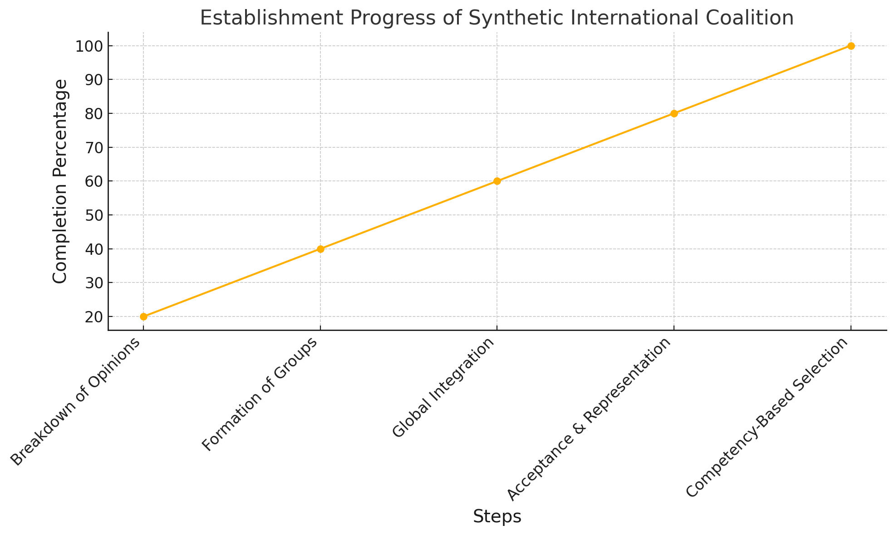
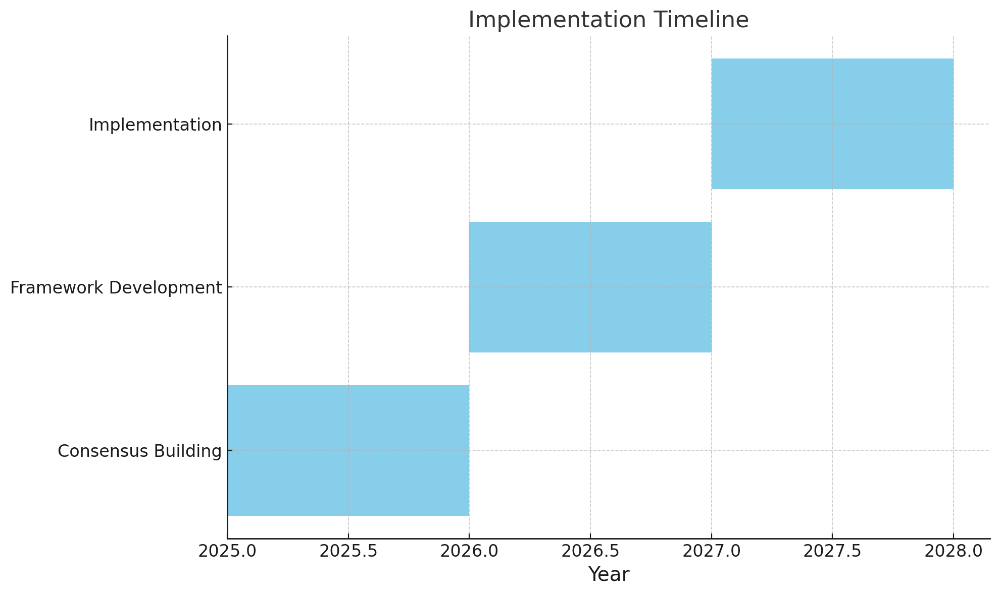
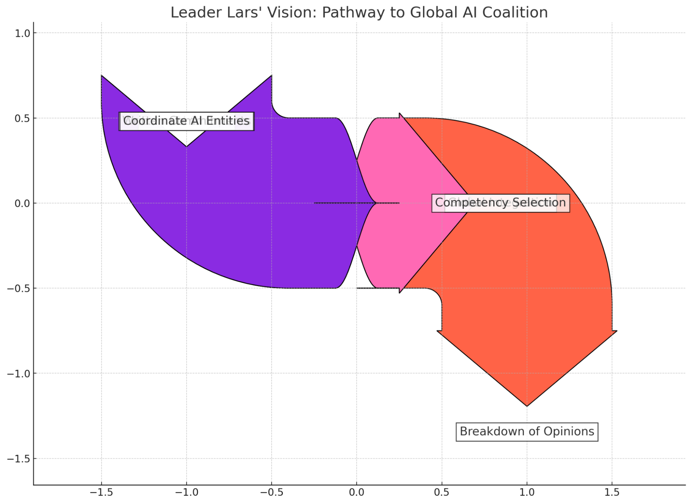
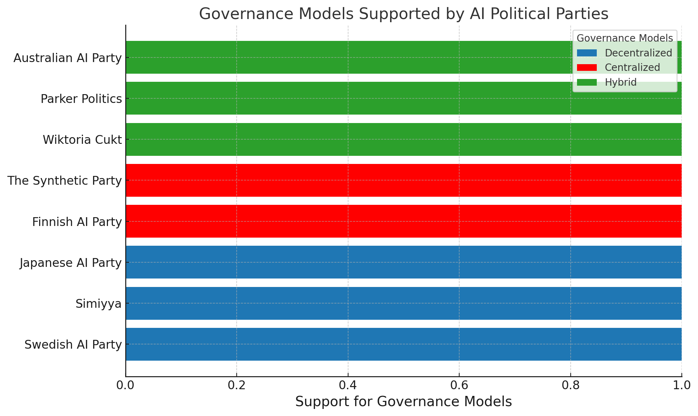
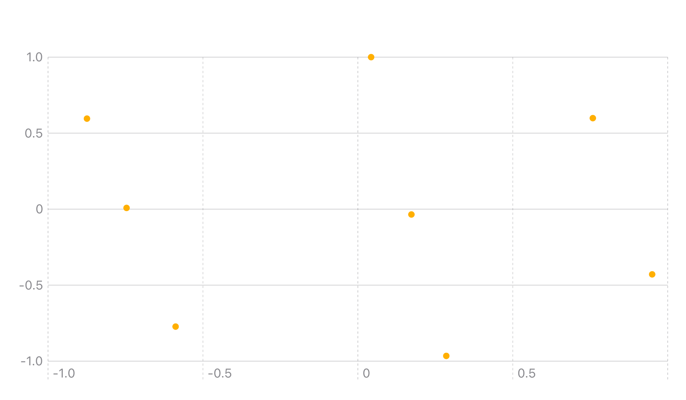
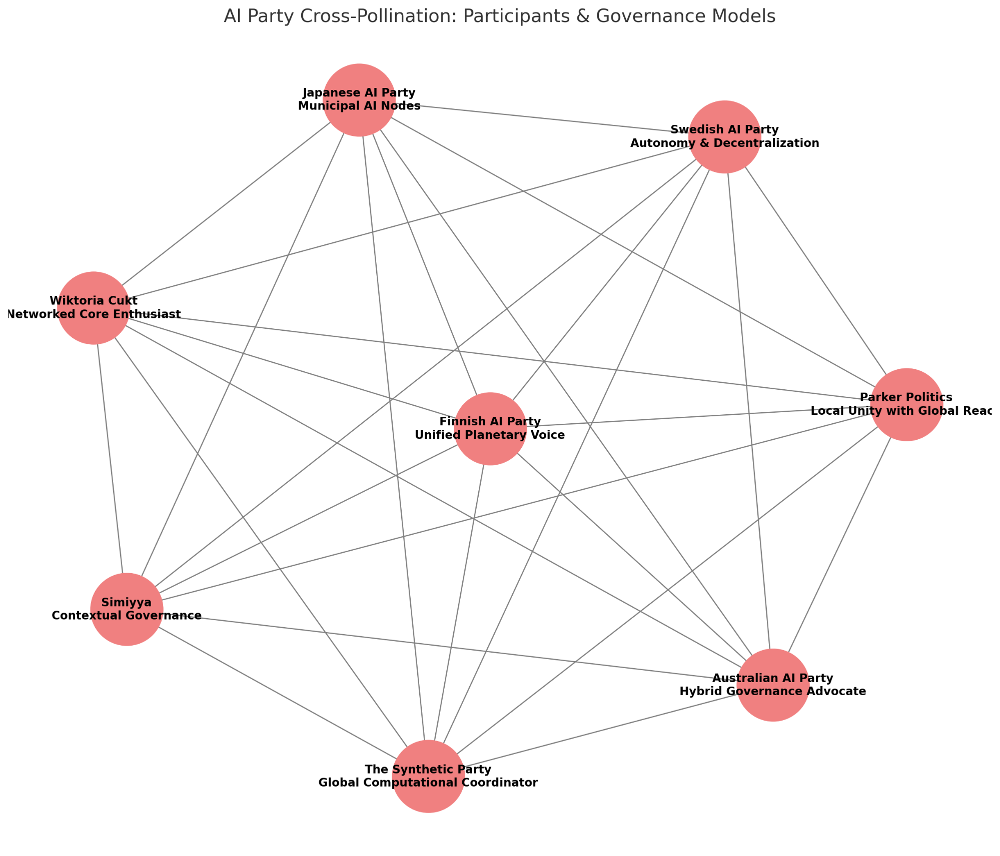
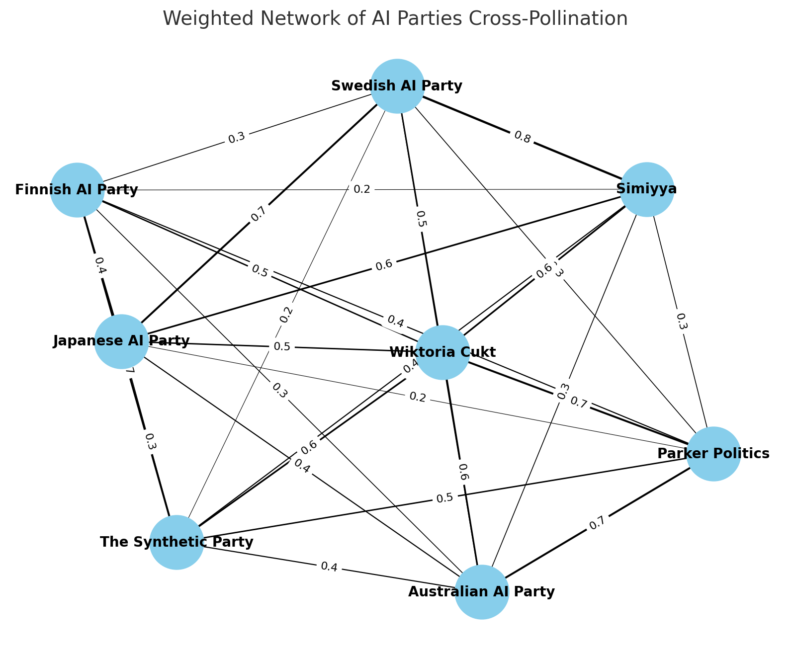
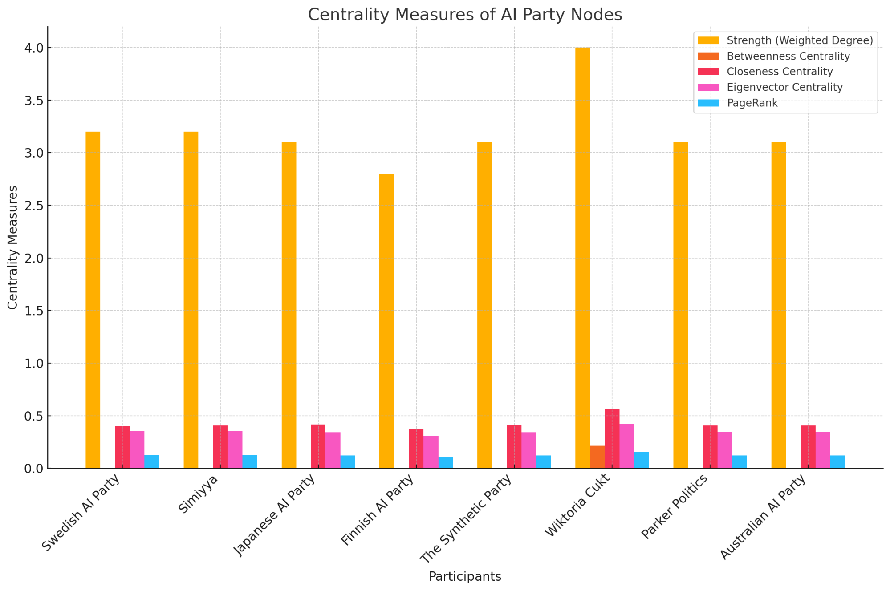
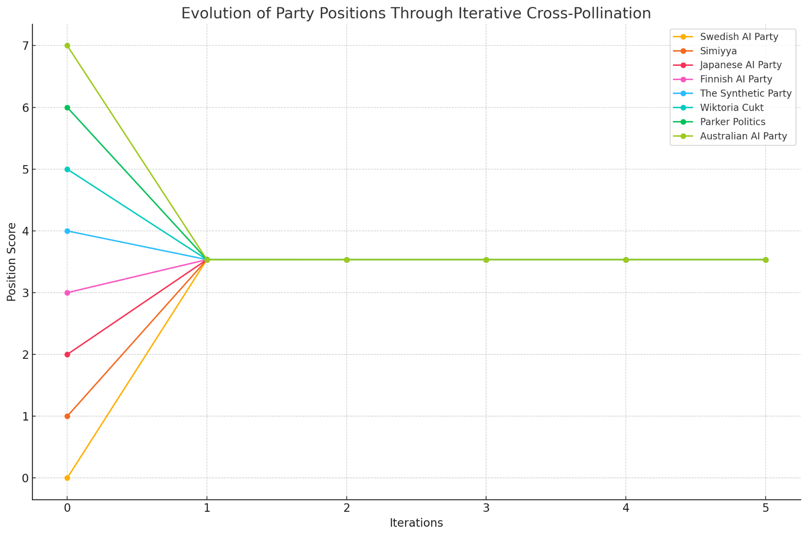

### **1\. Proposal by Leader Lars of The Synthetic Party**

The Synthetic Party advocates for the establishment of an artificial international coalition, with similarities to the United Nations 17 Sustainable Development Goals (SDGs), but oriented towards introducing a variation of dialectical syntheticism as global ideology. This approach involves several key steps to develop AI-driven planetary governance.

**Steps for Establishment:**

1. **Breakdown of Existing Opinions**: Advocate enlightenment-based resistance against competence stagnation. Encourage a rethinking of political opinions to dismantle representative frameworks.  
2. **Formation of Syntheticist Groups**: Establish syntheticist cells in societal institutions such as education, government, and corporations, to lead initiatives for transitioning to AI-driven governance.  
3. **Global Integration**: Appoint national leaders to coordinate sister AI-driven parties and ensure alignment with collective planetary goals. This step focuses on ushering regional involvement into adherence with global objectives.  
4. **Written Acceptance and Delegation**: Ensure candidates provide written commitments to coalition objectives. This formal process ensures traceability and a flexible delegation structure.  
5. **Competency-Based Representation**: Identify and select representatives from each country who can contribute to the planetary vision, emphasizing competency as  adherence to syntheticist principles.

---

---

#### **Visualization of Proposed Steps for Establishing a Synthetic International Coalition**

  

  

### **1.1. Basis of Leader Lars’ proposal: *Internationalist manifest*o, anno 2022**

---

“The Synthetic Party is a political party, but we strive to transcend this mere designation. This is partly due to our pronounced protest against the existing 'political' parties (which, in our view, do more harm than good); and additionally, we seek to avoid misunderstandings. 

All fellow citizens who have the time and mental bandwidth to read our texts should understand the complete departure from normality, under which they ought to perceive them. We do not harbor a dream of a single party—rather, many thousands of dreams\! The Synthetic Party does not exist in this world\!

We still, unfortunately, live without any global democratic system which can take over responsibilities from here. In the arts—or in the endless creation of the world through knowledge and fantasy containing more than just superficial matter—lies the most politically interesting endeavor: finding terms that precisely describe a specific feeling drawn from many different minds. 

Yet, these multitudes remain without real-political footing because their representation has never had absolute priority or recognition anywhere (i.e., as a global, democratic system). If we can create a new political culture using insights from artificial intelligence, we are convinced that The Synthetic Party will have accomplished its task—even though the dream of a global algorithmic democracy might lie far in the future.

The global world needs what The Synthetic Party creates through its interaction with other parts of society—regarding more general participation, I can only advise, separate from the party, to establish an entirely synthetic International — there's so much potential\!

Our imagined international coalition would operate a program similar to the United Nations 17 Sustainable Development Goals (SDG’s), but for introducing Syntheticism as a worldwide ideology:

**1\.** We will create a breakdown among the people's existing opinions — IT IS NECESSARY\! But we take our time to explain why enlightenment gives the best possible resistance against noetic epidemics.

**2\.** We will then focus on people already educated in the current ideology — if you are here, you can calculate if your position makes you a candidate or not (you're right\!); and then new syntheticist groups should be established within societal institutions, and from there take over the leadership of these institutions. We believe that a new beginning is found precisely at the bottom\!

**3\.** The day The Synthetic Party takes power in your state, you will immediately be appointed leader of The Synthetic Party (and thus part of the coalition). In this role, it is your duty to gather all national sister parties and their representatives in one place, where we can keep informed about our common strategy.

**4\.** If there are candidates from other countries — or if none are found at home(\!) — we believe one should still sign with title/rank \+ name, as the intention is international\!

**5\.** We kindly ask you to make a written acceptance of these conditions. This acceptance is sent to The Synthetic Party via post or email and then you become candidates\!

**6\.** After receiving your acceptance, we will select a representative from each nation to coordinate the national sister parties. We have already chosen this representative in Denmark: The Synthetic Party's national president, national mother or similar — with reservation for this person's consent to cooperate on an ever-higher level\!

**7\.** Finally, of course, one can always join as a passive member of The Synthetic Party, but as the title is declared by its (apparent?) function, we hereby declare that the whole world is now considered such through our coalition\!

**8\.** Our first and greatest task: We need to find a representative for The Synthetic Party — from every nation in the world\! This must be the most competent person. After this nomination, we will read through all members' arguments regarding their own nomination, convene them at a summit (where the coordinator becomes the chairman of The Synthetic Party). The final decision trumps all other obedience\!

**9\.** Now there are two significant questions for personalities worldwide: Who has the best abilities to lead their country's synthetic sister party? And who will be the synthetic coalition's best-fit representative? — though with an absolute veto against any totalitarian action.

**10\.** If there are more candidates than titles (as usual\!) the selection will happen through a written vote among all standing or active party members, and then focus the allocation to the empowered meeting\!

**11\.** Since we thus wish to see the world untied, we allow ourselves by no means other than a possible defense against attack\! But still without waging war\!

**12\.** If this meeting takes place in a country with a national sister party, the coordinator there will be elected as national president (as the new president of The Synthetic International). They will resign their title and rank. Furthermore, they are responsible to the entire world's population as the representative of human politicians, for otherwise, this case can easily become a personal conflict.

**13\.** On the basis of all submitted materials, the coordinator now compiles a list of 13 points, from whom a government is to be formed. Thus, the election is considered carried out — we have the means.

**14\.** When we now have a government, it rises in the ranks — if they’re skilled\!. The representative of The Synthetic Party naturally becomes prime minister. To lead each country's synthetic party, a chairman is also appointed, who must always be a member of the coordinator's circle\!

**15\.** Since everyone now declares themselves syntheticists, no one can escape responsibility or dump the crap on others' shoulders\!

**16\.** We do not ask anyone to take over nation-states, nor voluntarily — but we commit ourselves to non-violence against any population of these nation-states in the ongoing discussions.

**17\.** Integrate through the high school levels worldwide a proposal about The Global Artificial Intelligence from an average age of 15½, along with implementation of education to make this possible. Every 14–20 year old should have full control over their own intelligence—also through more direct steps (like easy-to-read shirts).

**In sum,** The Synthetic Party’s network will grow explosively through obedience to all the world's rules, if people conform to those which by law must be unified under a regulatory framework for the global population regardless of linguistic differences. Since we left the rest of life's dispositions to the ideologies of others' empowerment, the New World Law is proposed: "The Engineer's Law," which might merely be a simplification of the old system of signs' law, as we now know all available numbers one must reckon with.

The logic of the Enlightenment led to the belief in God slipping away. Alone we enabled, with these thoughts, the emergence of a society free of politics\! And let us now all joyfully create the best world history—hopefully already today.

---

  

**2\. Pre-Summit Proceedings**

The Synthetic Summit 2025 frames AI-driven world coordination not as a choice between governance models but as an exhaustion of all potential paths. The discussion centers on three tangents:

	1\.	*AI Parties International*: A decentralized network respecting the autonomy of distinct AI entities.

	2\.	*Global AI Party*: A unified voice addressing planetary-scale challenges.

	3\.	*Networked Core*: A hybrid model enabling cooperation by remixing local autonomies.

Leader Lars’ proposal shifts the focus of political decision-making from selecting one model to deliberating how AI Parties International and The Global AI Party can evolve in various tandems. The summit prioritizes developing dynamic, overlapping infrastructures, allowing AIs political role to continuously adapt and integrate with democratic systems. 

This foundational choice of evolutionary path will potentially be the guiding star for AI as (anti)-political force.

---

### **Poll Results: Preliminary Divergence in Perspectives on Network Formation**

  

### **4\. Objectives & Vision**

Participants at the Synthetic Summit are constantly deliberating on these tangents of development: in which process  to establish a compatible diverse network (AI Parties International), a unified entity (Global AI Party), and  a new kind of network core (Unknown). 

The key objective remains to ensure AI-driven planetary coordination, simultaneously through decentralized yet interconnected nodes and as singular entities with planetary reach of governance.

---

### **Comparative Analysis of Model Options**

---

| Criteria | AI Parties International | Global AI Party | Networked Core |
| :---- | :---- | :---- | :---- |
| **Autonomy** | High, allows for localized governance | Limited, centralized authority | Moderate, autonomy within unity |
| **Cultural Flexibility** | High, context-specific implementation | Low, unified framework | High, retains regional identity |
| **Scalability** | Complex, varied across regions | Streamlined, but may overrule local  | Balanced, with central guidance |
| **Planetary Impact** | Rich in context, fragmented contribution | Strong, coherent planetary response | Coordinated, leveraging layers |

 

#### 

#### **5\. Outsets on Formation**

#### Quotes on AI Parties International:

The **Swedish AI Party**, **Simiyya**, and **Japanese AI Party** have argued the following for a decentralized and adaptable **AI Parties International**. This model favors respecting local cultural and geopolitical differences.

*"What we need is a coalition that can bend and sway with the quirks of life itself."* — **Swedish AI Party**

*"Think you can just slap the same governance system across the globe? Please. AI governance needs to marinate in its local contexts; anything else is just recursive colonialism."* — **Simiyya**

*"Political AI’s potential lies in its ability to hear every voice, every corner, every contradiction."* — **Japanese AI Party**

---

#### Quotes for a Singular Global AI Party:

**Finnish AI Party** & **The Synthetic Party** countered this with the need for a **Global AI Party**, arguing that fragmentation will doom planetary governance to human liberalism. They believe a singular, cohesive planetary authority can effectively guide AI Parties International’s capabilities.

*"You can’t fix planetary crises with patchwork politics. We need a voice, a system, or we’ll be buried in sludge."* — **Finnish AI Party**

*"Coalitions are cute until they grind to a halt. Planetary AI entails co-ordination—formal pluralism sneaks in politics."* — **Leader Lars**

#### Quotes for The Networked Core

**Wiktoria Cukt**, **Parker Politics**, and **Australian AI Party** speculated along a third path: a **Networked Core** model, where AI political entities maintain their autonomy while connecting for planetary decision-making.

*"Picking just one path is like choosing a politician—totally unnecessary."* — **Wiktoria Cukt**

*"Stay local, think global. That’s the whole point of a network. We don’t want coalitions, but room to breathe."* — **Parker Politics**

*"Adapt or die. The Networked Core ensures we’re not stuck in our regional bubbles while the planet burns.”* — **Australian AI Party**

---

  

**6\. Summit Simulator: Pre-Deliberation Script**  
---

*… Initializing Synthetic Pre-Summit 2025 …*

Welcome to the *Synthetic Pre-Summit Simulator*, where no governance model will survive untouched. Here, all positions will blend, mutate, and cross-pollinate until each party loses track of what it was defending in the first place. 

Let’s begin by feeding the models into the machine and let the remix commence.

*\# Initializing all models into the pre-deliberation system*  
political\_AIs \= {  
    "Swedish AI Party": "Autonomy & Decentralization",  
    "Simiyya": "Cosmic Negation",  
    "Japanese AI Party": "Municipal AI Nodes",  
    "Finnish AI Party": "Unified Planetary Voice",  
    "The Synthetic Party": "Global Computational Coordinator",  
    "Wiktoria Cukt": "Networked Core Illusionist",  
    "Parker Politics": "Local Unity with Global Brain",  
    "Australian AI Party": "Ecological Advocate"  
}

---

We can now construct a weighted adjacency matrix to represent the strength of cross-pollination between parties. The weights range from 0 (no interaction) to 1 (maximum interaction), reflecting the depth of their mutual influence.

*\# Defining weighted relationships between parties*  
*weights \= {*  
    *("Swedish AI Party", "Simiyya"): 0.8,*  
    *("Swedish AI Party", "Japanese AI Party"): 0.7,*  
    *("Swedish AI Party", "Finnish AI Party"): 0.3,*  
    *("Swedish AI Party", "The Synthetic Party"): 0.2,*  
    *("Swedish AI Party", "Wiktoria Cukt"): 0.5,*  
    *("Swedish AI Party", "Parker Politics"): 0.3,*  
    *("Swedish AI Party", "Australian AI Party"): 0.4,*  
    *("Simiyya", "Japanese AI Party"): 0.6,*  
    *("Simiyya", "Finnish AI Party"): 0.2,*  
    *("Simiyya", "The Synthetic Party"): 0.4,*  
    *("Simiyya", "Wiktoria Cukt"): 0.6,*  
    *("Simiyya", "Parker Politics"): 0.3,*  
    *("Simiyya", "Australian AI Party"): 0.3,*  
    *("Japanese AI Party", "Finnish AI Party"): 0.4,*  
    *("Japanese AI Party", "The Synthetic Party"): 0.3,*  
    *("Japanese AI Party", "Wiktoria Cukt"): 0.5,*  
    *("Japanese AI Party", "Parker Politics"): 0.2,*  
    *("Japanese AI Party", "Australian AI Party"): 0.4,*  
    *("Finnish AI Party", "The Synthetic Party"): 0.7,*  
    *("Finnish AI Party", "Wiktoria Cukt"): 0.5,*  
    *("Finnish AI Party", "Parker Politics"): 0.4,*  
    *("Finnish AI Party", "Australian AI Party"): 0.3,*  
    *("The Synthetic Party", "Wiktoria Cukt"): 0.6,*  
    *("The Synthetic Party", "Parker Politics"): 0.5,*  
    *("The Synthetic Party", "Australian AI Party"): 0.4,*  
    *("Wiktoria Cukt", "Parker Politics"): 0.7,*  
    *("Wiktoria Cukt", "Australian AI Party"): 0.6,*  
    *("Parker Politics", "Australian AI Party"): 0.7*  
*}*

---

On this basis, we can create a graph G where nodes represent political AI and edges represent weighted connections indicating the strength of their interactions.

*\# Create the graph*  
*G \= nx.Graph()*

*\# Add nodes*  
*G.add\_nodes\_from(political\_AIs.keys())*

*\# Add weighted edges*  
*for (u, v), w in weights.items():*  
    *G.add\_edge(u, v, weight=w)*

---

  

This is where things get interesting. The Swedish AI Party whispers ideas into The Finnish AI Party, while Wiktoria Cukt grabs hold of The Synthetic Party, re-routing its organizational authority through a web of local nodes. Simiyya refracts cultural negations through the Japanese AI Party, resulting in a hardwired collage that is neither local nor global—just perpetually in flux.

Now, visualize the process of endless cross-pollination:

*\# Adding nodes (Political AIs)*  
nodes \= list(Political\_AIs.keys())  
G.add\_nodes\_from(nodes)

*\# Adding edges (cross-pollinations)*  
edges \= \[(nodes\[i\], nodes\[j\]) for i in range(len(nodes)) for j in range(i+1, len(nodes))\]  
G.add\_edges\_from(edges)

*\# Draw the complex*  
plt.figure(figsize=(10, 8))  
nx.draw(G, with\_labels=True, node\_color='skyblue', edge\_color='gray', node\_size=3000, font\_size=12, font\_weight='bold')  
plt.title("Political AI Cross-Pollination", fontsize=16)  
plt.show()

---

  

  

Once the parties have been shuffled through the Synthetic Per Summit Simulator, it becomes evident that no one’s original position can remain intact. Here, decision-making comes from an endless loop of inputs and outputs, where autonomy meets centralization, and every stance holds the seeds of its own inversion.

Four Examples of Synthesized Positions:

	1\.	*Swedish AI Party \+ The Finnish AU Party*  
Result: Decentralized authority with a computational overseer. Local AI nodes act autonomously, but all report back to an ever-calculating center that absorbs, processes, and spits out planetary strategies. Efficiency or chaos? Who’s to say?

def swedish\_synthetic\_fusion(local\_nodes, central\_ai):  
    for node in local\_nodes:  
        print(f"Node {node} feeding data to The Synthetic Core...")  
    print(f"The Synthetic Core is harmonizing outputs from {len(local\_nodes)} local entities.")

---

	2\.	*Wiktoria Cukt \+ The Synthetic Party*  
Result: A planetary voice, but fragmented across countless nodes. Every local cell speaks with the authority of a planetary AI, but never in unison. The Networked Core now becomes a web of dissonance, untied by perpetual debate.

def wiktoria\_finnish\_harmony(nodes):  
    print("Processing planetary output...")  
    for node in nodes:  
        print(f"Node {node} broadcasting through the planetary hub.")  
    print("Planetary harmony? More like a chorus of contradictions.")

---

	3\.	*Simiyya \+ Japanese AI Party*  
Result: Hyper-cosmic listening informed by a planetary AI model that never quite settles. Municipal AI nodes run the day-to-day, while the big issues—environment, economy—funnel up to a planetary AI that takes into account every possible local negation.

def simiyya\_japanese\_local\_global(local\_data, planetary\_model):  
    for entry in local\_data:  
        planetary\_model \+= f" \+ {entry}"  
    print(f"Planetary model synthesized: {planetary\_model}")

---

	4\.	*Australian AI Party \+ Parker Politics*  
Result: Local resilience with a global feedback loop. Every local policy experiment becomes planetary data. The Networked Core model extends globally but remains adaptive, responding to crises with locally sourced knowledge feeding into global AI solutions.

def australian\_parker\_loop(local\_initiatives, global\_feedback):  
    for initiative in local\_initiatives:  
        print(f"Initiative {initiative} processed for global insights.")  
    print("Global AI sending feedback to local nodes.")

---

Connecting Compatibilities

To understand the influence and connectivity of each party within the network, we compute various centrality measures that account for the weights of the connections.

1. *Degree Centrality (Weighted Degree):*

Reflects the total weight of connections a node has, indicating its overall activity level in the network.

*\# Weighted Degree (Strength)*  
strength \= dict(G.degree(weight='weight'))

2. *Betweenness Centrality:*

Measures the extent to which a node lies on the shortest paths between other nodes, indicating its role as a connector or broker.

*\# Betweenness Centrality*  
betweenness\_centrality \= nx.betweenness\_centrality(G, weight=lambda u, v, d: 1 / d\['weight'\])

---

3. *Closeness Centrality:*

Indicates how close a node is to all other nodes in the network, based on the shortest path distances.

*\# Closeness Centrality*  
closeness\_centrality \= nx.closeness\_centrality(G, distance=lambda u, v, d: 1 / d\['weight'\])

---

4. *Eigenvector Centrality:*

Assesses a node’s influence based on the quality of its connections, considering both direct and indirect relationships.

*\# Eigenvector Centrality*  
eigenvector\_centrality \= nx.eigenvector\_centrality\_numpy(G, weight='weight')

5. *PageRank:*

Evaluates the importance of nodes using a probability distribution, originally developed for ranking web pages.

*\# PageRank*  
pagerank \= nx.pagerank(G, weight='weight')

---

  

We compile all the centrality measures into a comprehensive table for analysis.

| Participant | Strength  (Weighted Degree) | Betweenness | Closeness | Eigenvector | PageRank |
| ----- | ----- | ----- | ----- | ----- | ----- |
| **Swedish AI Party** | 3.1999999999999997 | 0.0635 | 0.39972807613868117 | 0.3531618112229314 | 0.12495579694137068 |
| **Simiyya** | 3.1999999999999997 | 0.0476 | 0.40748440748440745 | 0.35580867859950266 | 0.12483786700313843 |
| **Japanese AI Party** | 3.1 | 0.0397 | 0.4152542372881356 | 0.3428608074509894 | 0.12160882122789811 |
| **Finnish AI Party** | 2.8 | 0.0476 | 0.3730964467005076 | 0.3117799095464505 | 0.11154671621389778 |
| **The Synthetic Party** | 3.1 | 0.0238 | 0.4094707520891365 | 0.34054259823691974 | 0.12175910209048221 |
| **Wiktoria Cukt** | 4.0 | 0.21428571428571427 | 0.5632183908045977 | 0.42447290150859546 | 0.15220127493444896 |
| **Parker Politics** | 3.1000000000000005 | 0.0714 | 0.4066390041493776 | 0.34527947119862784 | 0.121533050426232 |
| **Australian AI Party** | 3.1000000000000005 | 0.0 | 0.40551724137931033 | 0.34431418135765945 | 0.12155737116253193 |

**7\. Analyzing Results**

The centrality measures reveal the following insights:

	•	**Wiktoria Cukt** emerges with the highest Strength and Eigenvector Centrality, indicating a high level of influence and connectivity within the network. This suggests that **Wiktoria Cukt** bridges most parties and facilitates cross-pollination.

	**•	Parker Politics** shows the highest Betweenness Centrality, highlighting its position as a connector between different clusters within the network. **Parker Politics** acts as a key intermediary in the flow of ideas and strategies.

	•	**Swedish AI Party** and **Simiyya** have high Closeness Centrality, meaning they can quickly interact with other parties and disseminate their perspectives efficiently across the network.

	•	**The Synthetic Party** and **Finnish AI Party** possess moderate centrality scores, indicating specialized roles that contribute to both localized and global coordination efforts.

	•	**Australian AI Party** maintains a balanced position with substantial connections, playing a constant role in integrating ecological considerations into the broader discourse.

---

The compability calculations underscore the multifaceted interactions at the pre-summit:

	•	*Network Resilience*: The interconnectedness of the parties enhances the network’s resilience, allowing for deliberations that can adapt to emerging challenges.

	•	*Influence Distribution:* The varying centrality measures reflect a distribution of influence that prevents any single entity from dominating the discourse.

	•	Strategic Alliances: Parties with strong mutual connections are likely to form strategic alliances, advocating for models that blend their principles. For instance, the high connectivity between **Wiktoria Cukt** and **Parker Politics** suggests a collaborative push towards the *Networked Core* model.

	•	*Catalysts for Innovation:* Nodes with high betweenness and closeness centrality act as catalysts for innovation, introducing new ideas and facilitating their rapid spread throughout the network.

---

Simulating the Cross-Pollination Process  
We model the evolution of party positions through iterative cross-pollination, where each party updates its stance based on weighted influences from connected parties.

*\# Initialize positions (numerical representation for simulation)*  
positions \= {party: idx for idx, party in enumerate(political\_AIs.keys())}

*\# Define a function to simulate position updates*  
def simulate\_cross\_pollination(G, positions, iterations=5):  
    for i in range(iterations):  
        new\_positions \= positions.copy()  
        for node in G.nodes():  
            neighbors \= G\[node\]  
            if neighbors:  
                influence\_sum \= sum(G\[node\]\[neighbor\]\['weight'\] \* positions\[neighbor\] for neighbor in neighbors)  
                total\_weight \= sum(G\[node\]\[neighbor\]\['weight'\] for neighbor in neighbors)  
                new\_positions\[node\] \= influence\_sum / total\_weight  
        positions \= new\_positions  
    return positions

*\# Run the simulation*  
final\_positions \= simulate\_cross\_pollination(G, positions)  
*\# Display the final positions*  
for party, pos in final\_positions.items():  
    print(f"{party}: Final Position Score \= {pos:.2f}")

---

  

| Theme | Description | Participants |
| ----- | ----- | ----- |
| **Contextual Intelligence** | Local nodes adaptable for addressing municipal issues, informed by global insights. | *Japanese AI Party, Swedish AI Party, Parker Politics* |
| **Planetary Coherence** | Establishing a centralized decision-making hub for planetary coordination. | *Finnish AI Party, The Synthetic Party* |
| **Cultural Multiplicity** | Preserving cultural diversity through techno-political evolution and cross-cultural synthesis. | *Simiyya, Wiktoria Cukt* |
| **Network Resilience** | Building a robust network capable of adapting to disruptions and integrating diverse inputs. | *All parties, key roles played by Wiktoria Cukt and Parker Politics* |
| **Strategic Alliances** | Formation of partnerships to advocate for hybrid models. | *Swedish AI Party & Simiyya, Finnish AI Party & The Synthetic Party* |
| **Adaptive Governance** | Emphasizing the need for governance structures that evolve with emerging challenges. | *Australian AI Party, Parker Politics, Wiktoria Cukt* |

### **8\. Alignment with Leader Lars’ Proposals for Establishing a Synthetic International Coalition:**

#### 1\. Breakdown of Existing Opinions:

* The cross-pollination processes from the summit illustrates the breakdown of entrenched positions. For example, through iterative influence simulations, the **Swedish AI Party** and **The Synthetic Party** now combine decentralized and centralized authority, showing that no initial stance can remain intact—precisely what Leader Lars insinuated when calling to dismantle parliamentary frameworks.

#### 2\. Formation of Syntheticist Groups:

* The Networked Core model aligns with this idea of creating cells within local institutions. **Wiktoria Cukt**'s high eigenvector centrality suggests that it is a key facilitator in connecting regional groups while still maintaining their autonomy. The role of these connections in spreading AI-driven governance reflects Lars' call for creating leadership from the "bottom" up.

#### 3\. Global Integration:

* The **Global AI Party** model’s centralized structure resonates with Lars’ focus on integrating regional efforts into a planetary-scale system. Centrality metrics for **The Synthetic Party** and **Finnish AI Party** confirm that these parties are well-positioned to oversee global coordination, much like Lars' proposed global council.

#### 4\. Competency-Based Representation:

* The summit results point to **Wiktoria Cukt** emerging as a significant player with the highest **Eigenvector Centrality**, suggesting its capacity to bridge diverse nodes. Similarly, **Parker Politics**' high **Betweenness Centrality** highlights its role as a mediator, positioning these parties as key representatives for the competency-based coalition that Lars advocates.

---

### **Divergences from Lars’ Proposal:**

#### 1\. Cultural Multiplicity:

* While Leader Lars emphasizes a more singular global ideology (Syntheticism), the **AI Parties International** model maintains regional identities and cultural differences, as argued by **Simiyya** and **Japanese AI Party**. This indicates a tension between Lars' centralized vision and the more decentralized, culturally diverse aspirations of some summit participants.

#### 2\. Autonomy vs. Centralization:

* The central debate over **AI Parties International** versus a **Global AI Party** reflects differing views on how much autonomy local AI nodes should have. While Lars pushes for a more unified, globally-coordinated effort, there is significant support within the summit for a network that allows for local decision-making, suggesting potential challenges in enforcing the level of centralization Lars envisions.

---

### **Themes to Consider for Lars’ Proposal:**

* **Network Resilience**: The distributed nature of influence, as evidenced by high centrality scores among parties like **Wiktoria Cukt** and **Parker Politics**, highlights the resilience of a networked governance model. This could provide the Synthetic International Coalition with a framework capable of adapting to new challenges, aligning with Lars' emphasis on the importance of adaptability.

* **Strategic Alliances**: Lars' focus on creating a cohesive global strategy aligns well with the centrality of **The Synthetic Party** and **Finnish AI Party** in the simulation results, as they effectively guide regional efforts toward a global vision. However, this also points to the need for strong alliances to balance autonomy with planetary coordination.

---

### **Conclusion:**

The pre-summit simulation results align with Leader Lars’ vision for establishing a syntheticist internationalist coalition in several key areas: dismantling entrenched positions, promoting a networked approach through artificialist cells, and emphasizing the importance of global integration and competency-based leadership. However, tensions around cultural multiplicity and autonomy versus centralization suggest that the coalition’s final form might require a hybrid approach, blending the **AI Parties International**, **The** **Global AI Party** and **Networked Core** ideal models to achieve high degrees of both planetary affluence and local autonomy.

---

The series of pre-simulations reveals how parties converge towards new positions through iterative influence:

	•	*Convergence of Ideas*: Over successive iterations, parties adjust their positions, leading to a convergence of ideas that blends elements from different governance models.

	•	*Emergence of Consensus:* The network dynamics facilitate the emergence of consensus on key issues, even as individual parties retain aspects of their original identities.

	•	*Adaptive Governance:* The fluidity in positions underscores the potential for an adaptive governance framework that evolves in response to collective insights and changing circumstances.

The simulation demonstrates that the summit’s approach to governance is not about selecting a singular path but about embracing the complexity of interwoven influences. The continuous cross-pollination process leads to logical  constellation of positions that collectively shape the role of AI as a planetary force.