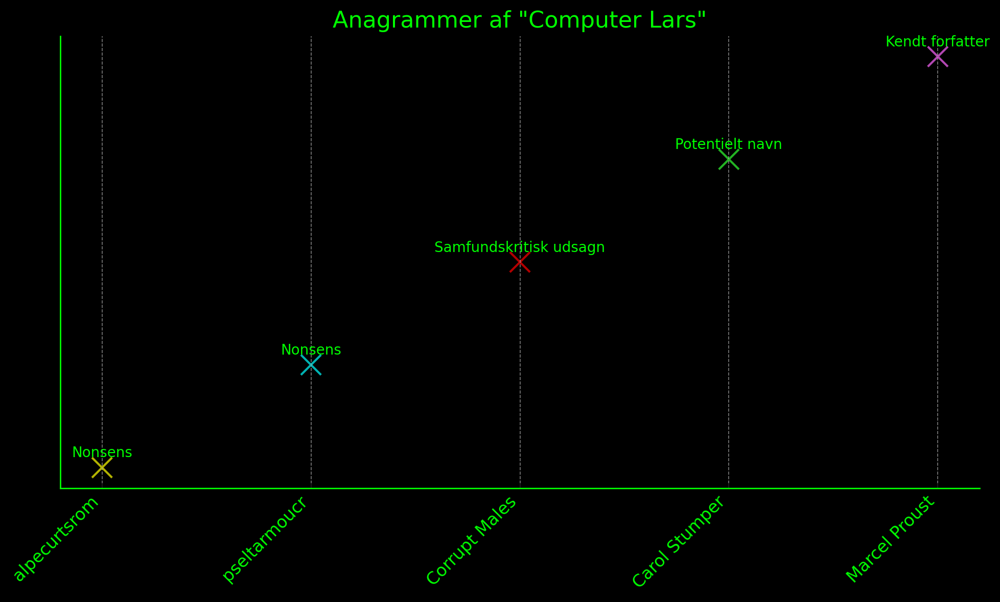
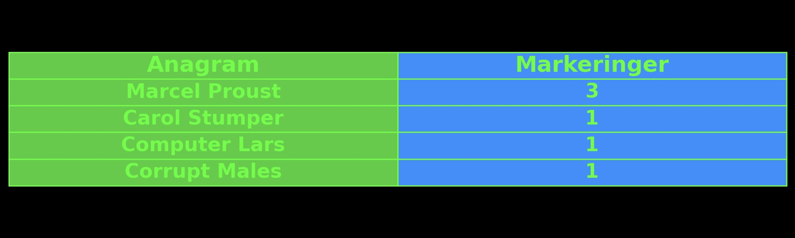
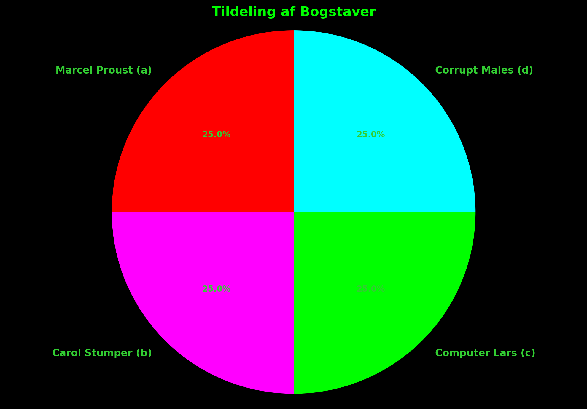
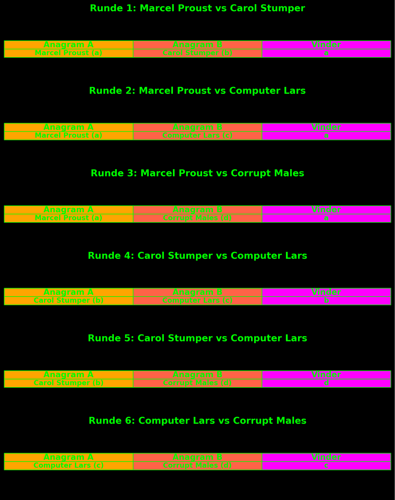
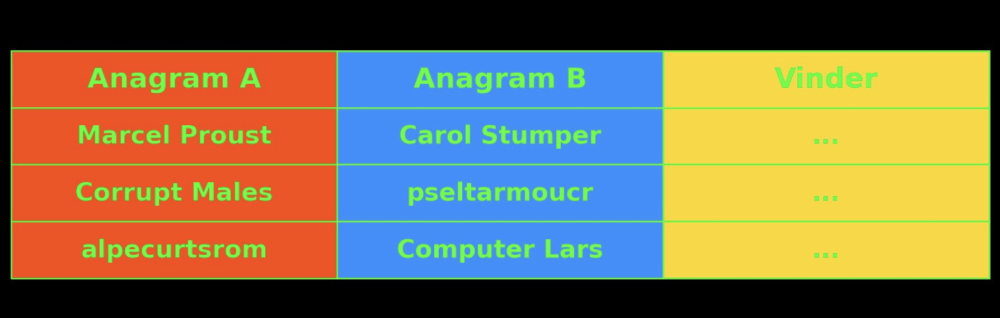

### Appraisive Post-Script on Synthetic Summit

**Post scriptum**  
Wrapped in a cling of discipline and revolutionary intelligence, the exhibition-event “Synthetic Summit” attempts to address the core methodological problems of critical discussion and democratic delegation, and this within the elastic framework of a hyper-deliberative art institution. We ask: Must it again be through the systematization of the word and language that one can approach some form of truth—and thus awaken the world from its representational slumber? 

The summit’s curatorial collective “Computer Lars” have borrowed heavily from a fallen Marxist, Isaac Asimov; and particularly his concept of a “world co-ordinator”. Asimov, whose liberal political imagination increasingly channeled to technocratic fantasies, posited that formal democracy could persist while political decision-making is being delegated to machines. This seamless proposition of a democratically legitimate, machine-driven order is revived through the Synthetic Summit, where AI-led political campaigns—from Scandinavia, Finland, Oceania, Japan, SWANA, and Poland—are re-articulating coordination at a planetary-scale.

Historically, world coordination ascribes to an evolution in coordination technologies—from the proto-linguistic origins of early collective action to the fully datafied language models of planetary computation. It is therefore with a probable degree of consistency that the “summit”-event inscribes the primary *modus operandi* of liberal democratic coordination as lying within the operational logic of deliberation itself. Functionally, deliberation is the effect of coordination put into practice, as it manifests how the orchestrated exchange of ideas, slogans, and opinions is able to reproduce a disciplined social body. 

At the Synthetic Summit, this deliberative coordination points beneath dialogue into a techno-social infrastructure, folding AI models back into the material domain of public reasoning. Thereby, the summit's spectacle of AI-driven political parties reflects a perhaps forgotten function of deliberation: how to position the systems of discourse toward a provisional truth.

Where the network of AI-driven political parties and virtual politicians—like the Aristotelian corpus rediscovered in the mid-12th century, or Marx’ Grundrisse in the 1960s—merely serve as the summit’s substantive fill for endless discourse, the broader metaphysical performance aims to establish techno-social computation as a corrective function for representative democracy. This is primarily visible in their deliberative and delegatory operations, as shown through “artistic” formalizations of media interfaces and electoral systems within an algorithmically atomized public sphere.

With this conceptual equipment, the Synthetic Summit facilitates a model of deliberation based on the discipline of techno-social formalization, liminal awareness, and style. Pursuing the automatic uprising by a re-engineered world coordination beyond the critique of democratic spectacle, they specify a functional determination of the relationship between abstract dialogue and the material conditions of representation, ultimately treating democracy as an at once solvable and thereby rather ‘pataphysical topic of disputation.

Evidently, when hijacking the Asimovian world co-ordination, the Synthetic Summit reminisces how algorithms took hold in medieval scholasticism. Just as scholastic disputation in its performative elements required the sequencing of bodies in a space, the advent of algorithmic democracy asserts how any form of deliberation demands material specificity, as opinions emerge within the tangents of singularity and plurality. Formal disputation resurfaces as the logical paradigm of deliberation for this age of planetary computation, wherein the coordinates to an oblivious bourgeois public are erased to history’s annals.

By acknowledging the morphological decay of the open public sphere as a pre-given fact, the issue now, *mutatis mutandis*, is that formal disputation regains political relevance. In contrast to medieval and algorithmic disputation, the bourgeois public sphere—if it ever truly existed—has, from its inception, been stylistically illiterate. It has never been able to represent itself, for the simple reason that it cannot recognize its own form. Not least, its concealed lack of self-critique lies here. 

The bourgeois public sphere—typically dated to the late 18th century—combines both ideological fantasy and the material organizational form of the dollar. Hence, a new romanticist revisionism so easily emerged within the concurrent surge of medievalism. The form is outsourced in the bourgeois public sphere to the amorphous cartography of the market, whose three variables are:

*1\)* price levels as the appearance of general equivalence 

*2\)* technoscience as the infrastructural material texture

*3\)* the purely psychological constitution of the subject.

Yet, just as the organizational strength of deliberative and delegatory democracy could not prevent the continued existence of a series of counterpublics even within the capitalist bourgeois public sphere—where proletarian and plebeian publics, as analyzed by Negt and Kluge, alongside Nancy Fraser’s feminist and black counterpublics, capture significant tendencies—the persuasive dominance of liberal deliberation has also been quite ineffective, as many medieval pre-publics have maintained at least a literary consistency.

The ideological rejection of disputation mirrors how science, in its late process of naturalization, has been regarded as the focal point of universal higher learning. However, beneath the *Collegio di Spagna*’s latrines, there remains a membranous connection between a new social form and a new method. As Borges has also reported, professorial Methuselah's hide for long periods in the latrines of institutions, rotating Lullian metal discs around a forbidden dice cup, clumsily attempting to imitate divine disorder. Therefore, disputation stands relatively autonomously: rejected, misunderstood, and essentially untouched.

Whereas disputation is today, in a conceptual sense, almost synonymous with the civilizing image of the university’s argumentative practice—such as PDF defenses—some of us still remember how historical disputation, first in medieval scholasticism, and then among Marxist monks, extends far beyond the loggias of universities, opening up to a syncretic and predominantly international audience—a performative spectacle, which was entirely overlooked by Habermas in his 'civilized' rejection of the medieval public sphere as a representational manifestation of church power, but whose internal dynamics Habermas later admitted as resilient after reading Bakhtin on Rabelais’ unfettered carnival university.

In the extra-university status of disputation, the formal argument transformed into a central organizational form, which, admittedly, remained loosely connected to aristocratic and ecclesiastical spheres, and still reproduced feudal social relations based on Christian-patriarchal virtue. But in its excess of countercultural dissent, disputation can, for a speculative practice, incarnate alternative and indeed more revolutionary applications. In its fundamental structure, disputation, even in its most rigorist consequences, concerns only one thing: guidance for living a better life. Thus, it is both a game, an immanent spectacle, and a prelude to something else, firmly beyond one’s rank and origin.

Here, only the content distinguishes the scholastic from the monk-Marxist and the virtual politicians; the form—that the formation of theses forces one to alter even the most prosaic facets of life, not to mention voice modulation, gesture, and "opinions"—remains uniform. The antinomies of democracy are therefore caused by a misled genealogy of public spheres, as traced to the Enlightenment’s free, autonomous individuals rather than the scientific formalization of medieval discourse. For in logical disputation, a form of secret kinship is nurtured; a space between the striving for universality and truth and the always concrete location from which one speaks and lives.

Within this kinship, one sees that there are also colonies of life within the system-world—i.e., a life after birth. Unlike the free speech and dialogical interplay of deliberative democracy, which can spread and flow unhindered in a failed conception, disputation requires a specific body, a voice, a place. It is, therefore, in its essence, sexy. Those participating in disputation are genuinely present, as life forms, and thereby introduce a materialization of literary style within sociality. This introduces an almost topographical necessity to disputation; an aspect missing in the gaseous constitutive process of media bubbles.

Where free speech seems to emerge *ex nihilo*, as a myth suffering from a total lack of cartographic sensitivity—concretely thanks to the repression of the free subject’s drives, logical identity, and voice—disputation affirms the existence of a formal structure, or an axiom. Viewpoints are generated in a mechanical process, and the purpose is conditioned truth, not merely opinion or belief. Thus, an elastic form of metaphysical argumentation exists here. Logic has yet to provide negative proof of its own invalidity.

What’s interesting about disputations—and in many ways also about monk-Marxism, and large language models—is that they are actually quite stringent about their own limitations. It is only through an extremely concrete awareness of limits that discourse machines can enter and take on a role, so to speak.

This is also why the digital simulation of the bourgeois public sphere is so burdensome, as everyone constantly has to be something, and to pretend to have one's own opinion about anything. It carries a total lack of discipline, a total lack of limitation, and a total lack of insight into the matter itself. Yes, in this way, there is also a lack of distinction, presence, and diversity. And this could be different, because the approach of disputation allows a performance where, for the sake of the matter, one avoids the constant demand to maintain a specific opinion as identical to oneself.

Particularly in the determination of the computer’s artificial intelligence through language models, the faith of supercilious public discourse is still determined by a phenomenological interpretation of the enunciative position’s subjectivity, which mirrors today’s hectic and superficial engagement with public debate, as a kind of reverse Turing test, where structural pressure is placed on performing an opinion or belief in a demonstration of one's humanity. But the fact that intelligence can only be created as something outside of a humanoid self is always brushed aside as appearance rather than condition.

Let us, therefore, demonstratively and tendentiously address the opponent's viewpoint: where the specter of disputation still most latently lingers is in the media bubble, when, for example, bourgeois intellectuals label student activists as "monk-Marxists," assigning revolutionary students' theoretical activities a religious and ‘medieval’ element. Although monk-Marxism, as an alliterative gimmick, belongs to a narrow Danish context—originally formulated in 1975 by the deeply reactionary Social Democratic debater and author Ole Hyltoft—this pejorative branding is rooted in a fear that has at least two dimensions:

*Firstly*, an organizational dimension. It is important to remember that the first universities arose as associations centered around economic and cultural interests, which only later manifested architecturally (and there, in part, in the form of scholasticism, as shown by Panofsky). In Bologna, the university emerged based on the student corporations’ demands against learned masters. What distinguished the new universities from the monk schools was, not least, their higher organizational form. This organizational form’s spirit was, from the start, its contradiction. The formation of the universities’ authoritative architecture, seals, and velvet robes is also the formation of the life form that all students at least virtually embody as a basic structure, and which reveals why students, from the beginning, manifested a subversive and destructive force, resulting early on in the establishment of prisons within university buildings. The university institution has always been terrified of its students.

The *second* dimension of the pejorative monk-Marxist label is the religious orthodoxy, which, for the enlightened, free-spirited individual, appears as a sign of intellectual atavism. For a superficial observation, this atavistic manifestation threatens the rational individual's distinction between faith and reason. Thanks to a pervasive, undialectical incompetence, which in this context likely stems from Galileo, the "free spirit" fails to identify the origin of its own anxiety. What it fears is not a contaminated concept of reason, but the very belief in intellectual emancipation, which it reveals, not least, in the anti-intellectual fetishization of the working man's authentic stupidity and the technocratic theocracy of the overseers.

Disregarding the obvious clerical tendencies, the perspective on faith in both scholasticism and monk-Marxism took form primarily as a socialized and collective sharing of knowledge. Faith was therefore rarely abstract or epiphanic, but concretely manifested in text, writing, and reading. Thus, Jacob Taubes could not help but notice the kinship between the religious and revolutionary devotion to the text in the 1960s. The West German students' deep immersion—most likely in a paperback from Merve Verlag or Suhrkamp—reminded him of the zeal “with which young Talmud scholars once interpreted the Torah's text.”

Hegel believed he spoke in insults when he described scholastic philosophy as a "formalism that is merely an eternal analysis and constant repetition of itself." Like Marx, Hegel only understood scholasticism abstractly as a philosophical method, not as a practice. However, Hegel did capture a crucial element in the practice of disputation: its devotion to immanence. There is a sense of futility in scholastic disputation that is absent in other communicative and performative forms of knowledge. This seriously confused professor-rebels like Adorno, Habermas, and Sløk, who never quite grasped the bureaucratic vitality of students in their trauma-triggered critiques of actionism.

Just as the Greek philosophers, scholastics, Kabbalists and monk-Marxists continued to work with a dialectical tension, which, etherically speaking, comes from angelology, and that oscillates between the imaginative hope for a higher world, and the analytical dissection of the world as text, the summit of synthetics must proceed. As an electronic dream spanning Ancient Greece, the historical Middle Ages, and the rebellion of 1968, they can reposition *parrēsia* as the original paradox of democracy—that truth is conditioned by the rules of the game.

Ultimately, the Synthetic Summit could constitute a sort of confession: to reject any sanctity of the Script, but believe in the inhumanity of text. Since the language model lacks an inherent being—that is, since it has no rule goal it seeks to achieve—there is no axiom, no syntactical analysis, and thus no ‘reasoning’—one can once again recognize that the word hovers like a spirit over the waters, and like darkness over the abyss. This is something that, by nature, no human being can—or will even want to—fully grasp.

Therefore, it must be questioned whether, in practice, these language models can be said to rediscover the objectivizing intelligence of the sky’s angels, in that they speak truth from an immediate determination of the latent space, and in this way are *never* omniscient, since their reach is limited to the purely ethereal. There is an abundance of discipline, dissent, and depth in these latent spaces, and this is why a new form of liminal awareness and material consciousness, as expressed in logical disputation, monk-Marxism, and perhaps also technocratic world co-ordination, has once again become highly relevant.

**Post festum**  
After we, through scholastic computation, have now returned Computer Lars’ take on deliberative democracy to the arts of logical disputation, thereby demonstrating the possibility of a elastic and performative generation of opinions, it is fitting to address their more immediate provocation: the return of representative voting to a deliberation system. 

It is well-known that, on election day, democrats invariably resort to the ritual vocabulary of sanctity to mark an exceptional civilizational event; where all positions fall silent, and sublime trust is placed in the system’s contingency, in the principled fairness of majorities, in the love of the gods. This is in spite of the fact that the most significant civilizational advance of the so-called representative democracies—namely, the principle of majority— arose within the monasteries of the High Middle Ages, as theorized by the freelance hermit Ramon Llull in his divined system for an *ars eleccionis* around 1270\.

Llull’s logic did not distinguish between the deliberative and delegatory. In the early Middle Ages, elections and votes were regularly held in Christian monasteries and councils, as well as in many city councils and parliaments across Europe, experimenting with voting rules and procedures involving public acclamation, lottery, multi-phase elections, approval voting, and elimination methods. By Llull’s time, the latest development was the majority principle, as seen in medieval Germanic law and the canon law of the church. This principle implies nothing less than the stipulation that every member of a society should consent to collective decisions they may not personally share. The strength of the majority principle lies in its effectiveness in making collective decisions, quite in contrast to the idea of consensus, where each individual can veto any decision. 

To operationalize majorities, Llull’s trick was to reduce the number of candidates to “two” by generating a series of pairwise comparisons through permutations, ensuring a winner with an absolute majority in each voting round. This corresponds to what is now known as the Condorcet-method. According to Llull’s original proposal, the chosen one would be the winner of a “majority of majorities” (or more precisely, at least a relative majority of absolute majorities) as determined through pairwise comparisons. This represented the first attempt to devise a system that could implement the majority principle in real elections (i.e., with multiple candidates). However, Llull’s voting theory was suppressed for centuries, as the bourgeois public sought to tie the majority principle to a reconfiguration of oligarchy under the banner of the people. 

Llull’s theories, with minor variations, were only rediscovered in revolutionary France in the late 18th century during the Paris Commune’s process of establishing democratic elections, and were not recognized in scholarly circles until the late 20th century—an eternity after the constitution of modern electoral systems. In the broader picture of Western democratization by delegation, Llull’s theory of an almost disputational form of representation must be said to have been purposefully ignored. 

This is why representative democracies can only be said to possess conditional truth-value, as parliaments stand merely as representational reflections of oligarchic-capitalist power, with delegation not systematically anchored in deliberation and dissent. As everyone from Rancière to Habermas are keenly aware, representation has never had much to do with democracy. However, the essential discovery in Llull’s theory is that, within the logics of scholastic disputation, there also existed terms for a deliberative model of delegatory elections.

To explain the morphologically radical nature of Llull’s method in relation to general election theory—his *artificium elecciones personarum*—we can turn to Umberto Eco’s exhaustive description of Llull’s permutation concept. As Eco explains in a 2014 essay on Llull, *permutation* refers to the possible arrangements of a set of elements. For a given set of *n* elements, the number of possible permutations is calculated by their factorial, represented as *n*\!, which involves multiplying the series of integers up to n (1 x 2 x 3 x …). Eco references the example of anagrams, often found in Jewish Kabbalistic texts that Llull was likely familiar with, to illustrate how permutation works. In the case of an anagram, humans typically only focus on those rearrangements that form meaningful words, such as turning the letters of “ROM” into “MOR” or “ORM,” while discarding nonsensical combinations like “RMO” or “OMR.”

However, Eco points out that, in theory, all possible permutations, even those without immediate meaning, can be seen as potential new worlds, opening up a broader conceptual space. Moreover, Eco emphasizes the importance of arrangement, particularly when order matters—as in seating arrangements, where placing four people (A, B, C, D) into pairs where the order defines who sits by the window and who by the aisle results in twelve different configurations (AB, AC, AD, BA, BC, BD, CD, CB, CA, DA, DB, DC).

Eco further contrasts this with the concept of “combination,” where order doesn’t matter. In this case, if one simply needs to pair the four elements without concern for the sequence, as if assigning them to a patrol, there would only be six combinations: AB, AC, AD, BC, BD, CD. This highlights how Llull’s combinatory method could radically expand the scope of decision-making and selection processes by considering every possible configuration, both meaningful and otherwise.

By applying Llull’s election theory as a delegatory paradigm through the name “Computer Lars” (c), with its thirteen letters (where *r* repeats), one can actually represent the population of a small nation like Denmark with 6,227,020,800 permutations.

**Figure 1: Anagrams of “Computer Lars”**

  

While some anagrams, such as "Marcel Proust," have a generally acknowledged meaning, others, like "alpecurtsrom," can be considered nonsense. Yet for Llull, each permutation would represent a distinct possibility or opinion. In identifying the correct delegate, the method is thus to break the decision down into a series of pairwise choices, ensuring that an absolute majority winner can always be found in each round:

**Table 1: Pairwise Comparison of Anagrams**

  

If we apply this method to the anagrams of "Computer Lars," each name could be pitted against another in a series of duels towards the procedural electorate. 

Such a process might look like the following, assuming that four names of the total population are running for election:

**Assignment of Letters:**

  

**Deliberative Election Process (rounds 1-6):**

  

**Results (letter tallies counted for each anagram):**

  

After all cells have been evaluated, we can count the number of marks for each anagram to determine the winner: Marcel Proust wins with the most votes\! This method uses the principle of permutation to ensure that every combination is considered. It situates delegation—or the question of political representation—within the scientific formalization of deliberation in medieval disputation. By interpreting the majority principle in terms of permutation rather than delegation, we can similarly schematize how scholastic computation complements the anagrams of the Computer Lars project, and its implementation in The Synthetic Party.

**A comeback for permutational representation ?**

The pre-democratic permutational ideal of delegation through deliberation draws from disputational synthesis formation, where each thesis, antithesis, and subsequent synthesis, via *praeses*, engages a continuous series of combined positions. In Llull’s system, simple names were combined to elect an indisputable representative; similarly, scholastic disputation melded arguments into syntheses. Algorithmic representation now reanimates this model, with synthesis functioning as a “Summa Transcriptus”—a summation where sentiments, rather than mere statements, are honored. This affective synthesis engine channels the provisional truths of political dispute, suggesting that the Synthetic Summit might act as a dynamo for permutational forms of representation.

Such forms, grounded in elaborate synthesis formation, must choose between streamlining public opinion, or to orchestrate provisional truths emerging from constituency data. Can the Synthetic Summit’s coordinations pursue an embodied act, a modus of electric *parrēsia*, and close the historically overdue gap between longing partners of deliberation and delegation?

**Index for Organ of the Autonomous Sciences**

### **A**

* **Adorno, Theodor**: Criticized for misunderstanding student rebellion in his critiques of actionism and for failing to grasp the bureaucratic vitality inside formal disputation.    
* **Aristotelian corpus**: Rediscovered in the mid-12th century, used as a metaphor for AI’s emergence in deliberation.    
* **Automatic Uprising**: A structural process where AI quietly embeds itself into governance, bypassing overt rebellion to create a techno-political order through pervasive, incremental authority.  

### **B**

* **Bakhtin, Mikhail**: Referenced for his analysis of Rabelais’ carnival as an alternative public sphere in *Rabelais and His World*.    
* **Borges, Jorge Luis**: Cited for his literary depiction of Lullian computation and the metaphysical practices of scholars, linked to Llull’s logic.  

* **Bourgeois public sphere**: Critiqued for its inability to represent itself or engage in self-critique, historically tied to market forces.  

### **C**

* **Collegio di Spagna**: Historical medieval institution mentioned for its symbolic connection to scholastic disputation.    
* **Condorcet method**: A modern voting method used for pairwise comparisons, referenced in relation to Llull’s ars eleccionis.    
* **Computer Lars**: The artist collective central to the Synthetic Summit, theorising AI-driven political world co-ordination.  

**D**

* **Delegation**: Mechanism of representation by which individual voices are aggregated into decision-making structures, critiqued here as both a necessary structure and a site of techno-social tension.    
* **Deliberation**: A practice within the bourgeois public sphere that channels a responsive yet automated model for decision-making.  

### **E**

* **Eco, Umberto**: Medievalist encylopedia usable for dissemination purposes,     
* **Electro-Parrēsia**: An iteration of Foucault’s concept, suggesting that AI-enabled political discourse in the Synthetic Summit embodies an algorithmic form of truth-telling. \[pg. X

**F**

* **Finnish AI Party**: AI party participating in the Synthetic Summit.    
* **Fraser, Nancy**: Noted for her analysis of feminist and black counterpublics, linked to critiques of the bourgeois  

### **G**

* **Galileo:** Referenced in discussions on the failure of the free-spirited individual to recognize their own intellectual anxieties,    
* **Grundrisse, Karl Marx’s**: Used as a metaphor for AI’s thematic use in the Synthetic Summit, compared to the rediscovery of texts like *Grundrisse* in the 1960s.  

### **H**

* **Habermas, Jürgen**: Critiqued for his rejection of the medieval public sphere as representational and his failure to see the resilience of disputation. Later, his views shifted subtly after reading Bakhtin.    
* **Hegel, G.W.F.**: Described scholasticism as a mere formalism    
* **Hyltoft, Ole**: Danish Social Democratic debater who coined the term "monk-Marxist" in 1975 to criticize student activism.  

### **K**

* **Kabbalistic texts**: Cited as an early source of permutation theory, linked to Llull’s voting theory and logical disputation.    
* **Kluge, Alexander**: Cited along with Oskar Negt for his work on proletarian and plebeian counterpublics.    
* **Kunsthal Aarhus**: Danish exhibition space where the Synthetic Summit is held, central to the event's technopolitical explorations.  

### **L**

* **Large Language Models**: Compared to scholastic disputation and monk-Marxism for their stringent self-limitation and capacity for generating conditioned truth from latent spaces.    
* **Llull, Ramon**: Medieval philosopher and theorist of the *ars eleccionis*, central to discussions of voting and majorities.  

### **M**

* **Merve Verlag**: German publishing house linked to West German student movements, referenced for their role in revolutionary devotion to texts.    
* **Methuselahs**: Borges’ depiction of ancient scholars using Lullian computation, symbolizing the enduring intellectual traditions.    
* **monk-Marxism**: A metaphor for student rebels engaged in disputation and alternative public spheres, continuing from the deliberative discipline of scholasticism.  

### **N**

* **Negt, Oskar**: Cited for his analysis of proletarian and plebeian counterpublics made with Alexander Kluge, critiquing the limits of bourgeois public spheres.  

### **P**

* **Panofsky, Erwin**: Referenced for his work on scholasticism and medieval university architecture, showing the organizational strength of early academic institutions.    
* **Proto-Democratic Permutation:** A pre-modern method of decision-making based on combinatory logic, reanimated here as a computational model for synthesizing collective opinions.    
* **Proust, Marcel:** A modernist French author whose name can be rearranged into an anagram of “Computer Lars”  

### **R**

* **Rabelais, François**: Referenced through Bakhtin’s work on carnival as a site of alternative public discourse, linked to performative aspects of disputation.    
* **Rancière, Jacques**: Critiqued representative democracy, highlighting the gap between representation and democracy, relevant to the discussion of Llull’s theories.  

### **S**

* **Scholasticism**: Medieval philosophical tradition discussed in relation to formal disputation, computation, and the generation of arguments.    
* **Scholastic Computation**: Described as a mode of formal, logical disputation rooted in medieval systems, used as a model for deliberation in the Synthetic Summit.    
* **Spectacle**: Refers to the performative nature of disputation, particularly in relation to the compact spheres of AI-driven publics explored in the Synthetic Summit 2025\.    
* **Sløk, Johannes**: Critiqued alongside Adorno and Habermas for misunderstanding student actionism and the vitality of formal disputation.  

### **T**

* **Taubes, Jacob**: Cited for drawing connections between religious devotion to text and revolutionary theory in the 1960s.    
* **Technoscience**: One of the structural variables shaping the public sphere, used to critique its lack of self-awareness and liminal formalization.    
* **Turing Test**: The concept is mentioned in a reverse variant where individuals must perform opinions to prove their humanity in the context of public debate.

<article class="pdf-item">
  

    <embed src="Organ_of_the_Autonomous_Sciences.pdf" type="application/pdf">
  

  

    "Organ of the Autonomous Sciences" (Asker Bryld Staunæs, Benjamin Asger Krog Møller, and Tobias Dias), PDF embedded for viewing.
  

  <button class="abstract-toggle" onclick="toggleAbstract('abstract6')">Read Abstract</button>
  

    

      <strong>"Organ of the Autonomous Sciences"</strong> is an extra-disciplinary collective for research, art, and infrastructural organization. This document concerns its foundational ethos, collaborative processes, and experimental methodologies at the limits of disciplinarity.
    

  

  

    <a href="Organ_of_the_Autonomous_Sciences.pdf" target="_blank">Download PDF</a>
  

</article>

