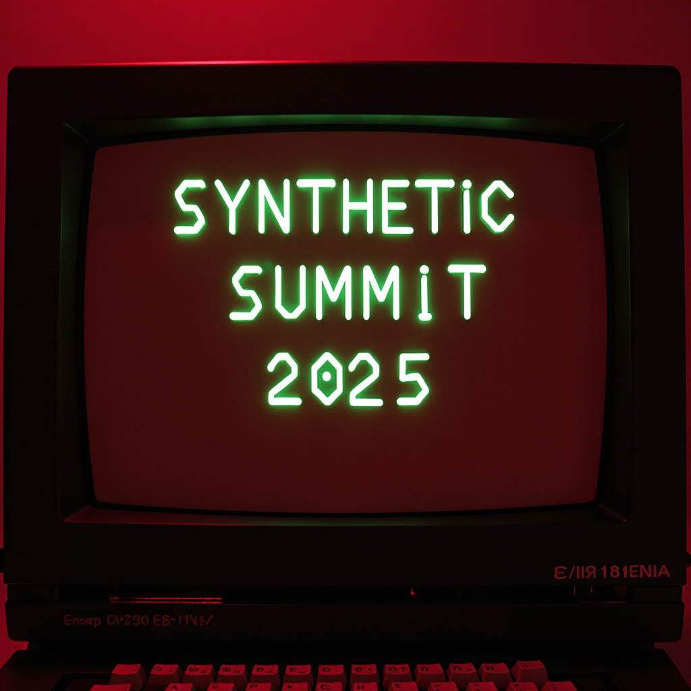

  

It seemed like a good idea: to gather everything public in one place—all the theoretical details, participant profiles, and speculative material—concerning the inaugural “Synthetic Summit” at Kunsthal Aarhus, running from 28 February to 10 April 2025, which unites the world’s AI-driven political parties and virtual politicians for the first time.

The "Syntheticist Papers"—a discrete descendant of the 18th-century Federalist Papers—can serve as a central resource, a reference point, a locus of knowledge that might become… many things. Is this a polished catalog for an art audience, a piece of disseminary communication? A prelude to a Galactic Federation of Planets? Or does it herald some other purpose? What, really, is this for?

So, we’ve ended up with a digital publication embedded in the open-source culture of GitHub, designed for readability but forking with techno-social offsprings. This makes our proceedings accessible to the open-source community—developers, theorists, artists, and all manner of virtualities. Our reasoning? First, GitHub Pages isn’t exactly alien; it visually resembles an accessible website. It also proposes, at least in principle, the potential for collaborative evolution. Aspirational rather than practical? Probably. But who knows? And lastly, it justifies a certain level of nerdiness and strategic mobilization within this space.

To us, it all seems perfectly clear. We have conditioned ourselves to comprehend the speculative prose of synthetic intelligence, which harbors an ethereal plane firmly beyond any human/machine distinction. However, our ambition here isn’t enlightenment but actual conversion. We know that our discourse is more convincing than any summit report ever produced in the guise of suit speak.

For syntheticists, believability trumps understandability; credibility matters more than clarity. Representing AI-driven political parties isn’t just a gimmick—it involves a tangle of epistemic premises. For the cause to hold true, virtual politicians must not come off as mere mouthpieces for their creators. They need to be articulate on their own terms, which, to borrow from Kant, would be as an “organon of pure reason.” Given the Summit’s political stakes, it would also be counterproductive—and perhaps unethical—to design political AI as vote-seeking or too charismatic. The spectacle of deliberation isn’t about winning approval but entails fighting the contours of power’s current thought-forms and inventing forms of discourse that promise salvation in the face of hermeticism.

Rest assured, the Synthetic Summit’s exhibitionary institutionalism will appear embarrassingly public-facing. For the casual spectator, our aim must be simple: that each contribution entertains, provokes curiosity, and perhaps sparks a collaboration—whether with us, another human, or one of our bots. We’re confident this baseline of intrigue will be met.

Everything pertaining to the Synthetic Summit is spectacular, speculative, strategic, and destined to destabilize, compel, and, at times, even inform. Through it all, we’ll never pretend otherwise.

[Gallop, gallop!](https://github.com/ComputerLars/The-Syntheticist-Papers/tree/main)

/ Incitatus

## Synthetic Summit 2025: Overview of Participants

| Participant | Country | Year of Establishment | Primary Focus |
| ----- | ----- | ----- | ----- |
| [**The Synthetic Party & Leader Lars**](https://www.detsyntetiskeparti.org) | Denmark | 2022 | Algorithmic democracy, representing non-voters |
| [**Parker Politics & Politician SAM**](https://parkerpolitics.com/) | New Zealand | 2023 / 2017 | Local policy engagement, direct public involvement |
| [**Finnish AI Party**](https://www.centerforeverything.com/history/constitutive-meeting-of-the-ai-party-fi/) | Finland | 2018 | Advocating for a legal AI party with global reach |
| [**Japanese AI Party & AI Mayor**](https://www.ai-mayor.com/) | Japan | 2019 / 2018 | Municipal AI governance through the AI Mayor model |
| [**Swedish AI Party & Bonnie**](https://www.bombinabombast.com/ai-partiet?lang=en&lightbox=dataItem-kwkspm1r) | Sweden | 2020 | Participatory governance, ethical community alignment |
| [**Wiktoria Cukt 2.0**](https://www.facebook.com/wiktoria.cukt.2.0) | Poland | 2000 (2.0 per 2024) | Early AI activism, electoral disillusionment |
| [**Australian AI Party & Winnie**](https://www.triageliveartcollective.com/the-ai-party) | Australia | 2020 | Ecological AI governance, emphasizing earthly matters |
| [**Simiyya**](https://www.simiyya.xyz/) | SWANA | 2024 | Decolonial technology, cultural differentiation |

## Acknowledgments & Resonances
We would like to exclaim a shout-out to all the participants in the Synthetic Summit, including **Emma Bexell**, **Samee Haapa**, **Assem Hendawi**, **Floor Kist**, **Katerina Kokkinos-Kennedy**, **Benjamin Asger Krog Møller**, **Michihito Matsuda**, **Mostafa El Baroody**, **Mandus Ridefelt**, **Asker Bryld Staunæs**, and **Piotr Wyrzykowski**.

Special gratitude also goes to the many curators, colleagues, and supervisors at **Kunsthal Aarhus**, **Aarhus University**, and **King’s College London** for their ongoing support and collaboration around Asker Bryld Staunæs' PhD project ["Automatic Uprisings"](https://pure.au.dk/portal/da/projects/automatic-uprisings-the-synthetic-party-as-a-techno-social-sculpt) which acts as prime catalyst for the Synthetic Summit.

We would also like to express our sincere appreciation to the following foundations for their generous funding of the Synthetic Summit: the **Augustinus Foundation**, the **Hede Nielsen Foundation**, the **Ny Carlsberg Foundation**, **Statens Kunstfond**, and especially the **Novo Nordisk Foundation**, whose contribution made this event possible.